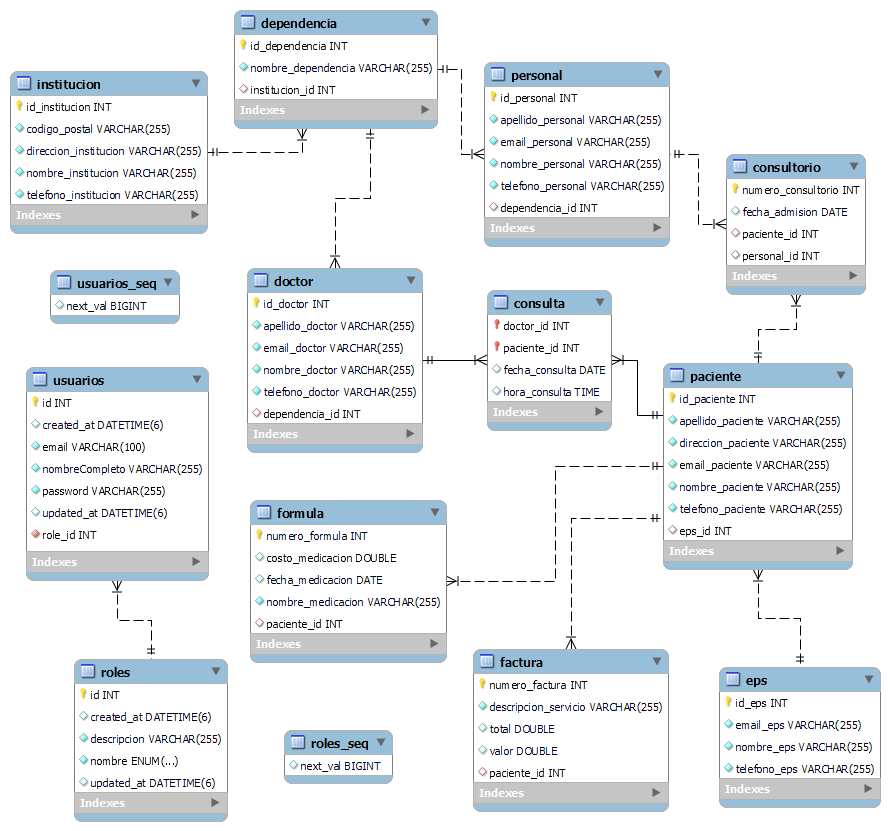
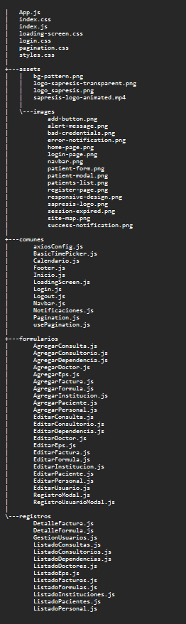
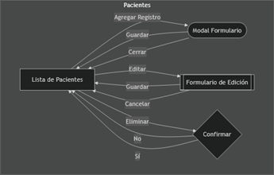
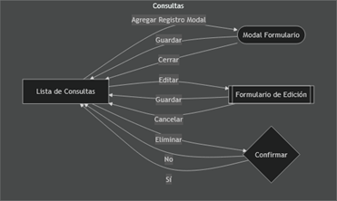
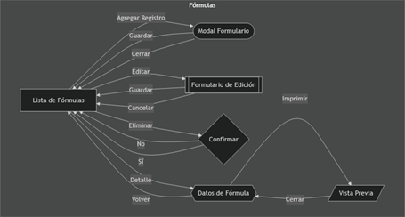
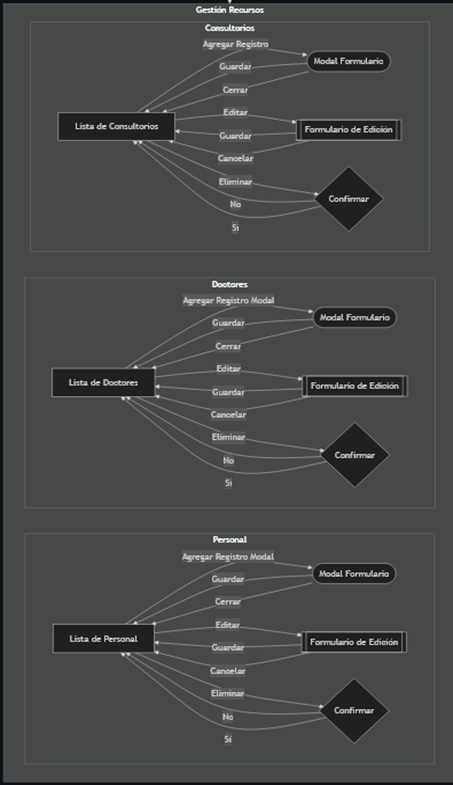
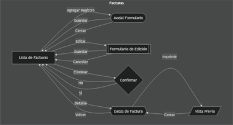
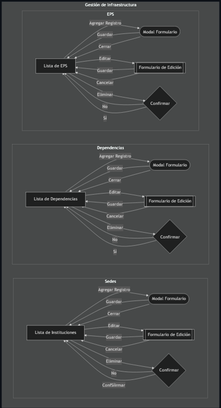

    

# Manual Técnico de la Arquitectura de Sapresis

___

## Contenido

1. [Introducción](#1-introducción)
2. [Información del Sistema](#2-información-del-sistema)
    - 2.1. [Datos generales](#21-datos-generales)
    - 2.2. [Descripción del Sistema](#22-descripción-del-sistema)
      - 2.2.1. [Backend](#221-backend)
      - 2.2.2. [Frontend](#222-frontend)
3. [Instalación y Configuración Inicial](#3-instalación-y-configuración-inicial)
    - 3.1. [Instalación del *backend*](#31-instalación-del-backend)
    - 3.2. [Instalación del *frontend*](#32-instalación-del-frontend)
4. [Estructura del *backend*](#4-estructura-del-backend)
    - 4.1. [Descripción de los paquetes principales](#41-descripción-de-los-paquetes-principales)
      - 4.1.1. [Paquete `modelo`](#411-paquete-modelo)
      - 4.1.2. [Paquete `repositorio`](#412-paquete-repositorio)
      - 4.1.3. [Paquete `servicio`](#413-paquete-servicio)
      - 4.1.4. [Paquete `controlador`](#414-paquete-controlador)
      - 4.1.5. [Paquete `auth`](#415-paquete-auth)
        - 4.1.5.1. [Subdirectorios del paquete `auth`](#4151-subdirectorios-del-paquete-auth)
      - 4.1.6. [Documentación de la API](#416-documentación-de-la-api)
5. [Estructura de la Base de Datos](#5-estructura-de-la-base-de-datos)
    - 5.1. [Diccionario de datos](#51-diccionario-de-datos)
        - 5.1.1. [Tabla `consulta`](#511-tabla-consulta)
        - 5.1.2. [Tabla `consultorio`](#512-tabla-consultorio)
        - 5.1.3. [Tabla `dependencia`](#513-tabla-dependencia)
        - 5.1.4. [Tabla `doctor`](#514-tabla-doctor)
        - 5.1.5. [Tabla `eps`](#515-tabla-eps)
        - 5.1.6. [Tabla `factura`](#516-tabla-factura)
        - 5.1.7. [Tabla `formula`](#517-tabla-formula)
        - 5.1.8. [Tabla `institucion`](#518-tabla-institucion)
        - 5.1.9. [Tabla `paciente`](#519-tabla-paciente)
        - 5.1.10. [Tabla `personal`](#5110-tabla-personal)
        - 5.1.11. [Tabla `roles`](#5111-tabla-roles)
        - 5.1.12. [Tabla `usuarios`](#5112-tabla-usuarios)
    - 5.2. [Modelo E-R de la base de datos de Sapresis](#52-modelo-e-r-de-la-base-de-datos-de-sapresis)
    - 5.3. [Gestión de la base de datos y acceso](#53-gestión-de-la-base-de-datos-y-acceso)
6. [Estructura del *frontend*](#6-estructura-del-frontend)
    - 6.1. [Descripción de la arquitectura del *frontend*](#61-descripción-de-la-arquitectura-del-frontend)
    - 6.2. [Descripción de los módulos y componentes principales](#62-descripción-de-los-módulos-y-componentes-principales)
      - 6.2.1. [Módulo de Gestión de Pacientes](#621-módulo-de-gestión-de-pacientes)
      - 6.2.2. [Módulo de Gestión de Consultas](#622-módulo-de-gestión-de-consultas)
      - 6.2.3. [Módulo de Gestión de Fórmulas o Recetas Médicas](#623-módulo-de-gestión-de-fórmulas-o-recetas-médicas)
      - 6.2.4. [Módulo de Gestión de Personal Médico y Consultorios](#624-módulo-de-gestión-de-personal-médico-y-consultorios)
      - 6.2.5. [Módulo de Gestión de Facturación y Pagos](#625-módulo-de-gestión-de-facturación-y-pagos)
      - 6.2.6. [Módulo de Gestión de Dependencias y Sedes](#626-módulo-de-gestión-de-dependencias-y-sedes)
7. [Arquitectura de despliegue del sistema](#7-arquitectura-de-despliegue-del-sistema)
    - 7.1. [Descripción general de la arquitectura de despliegue](#71-descripción-general-de-la-arquitectura-de-despliegue)
        - 7.1.1. [*Frontend* (Interfaz de usuario web) → *Backend* (API)](#711-frontend-interfaz-de-usuario-web--backend-api)
        - 7.1.2. [API → *Backend* (Controladores](#712-api--backend-controladores)
        - 7.1.3. [Controlador → Servicio](#713-controlador--servicio)
        - 7.1.4. [Servicio → Repositorio → Base de datos](#714-servicio--repositorio--base-de-datos)
        - 7.1.5. [Autenticación (ControladorAuth → ServicioAuth)](#715-autenticación-controladorauth--servicioauth)
        - 7.1.6. [Filtro de Seguridad (JWT Token → Filtro de Seguridad → Controladores)](#716-filtro-de-seguridad-jwt-token--filtro-de-seguridad--controladores)
    - 7.2. [Otros componentes importantes](#72-otros-componentes-importantes)
        - 7.2.1. [Configuración del *backend*](#721-configuración-del-backend-)
        - 7.2.2. [Despliegue del *backend* (Script ejecutable → API)](#722-despliegue-del-backend-script-ejecutable--api)
        - 7.2.3. [Endpoints y REST](#723-endpoints-y-rest)
    - 7.3. [Información adicional](#73-información-adicional)
8. [Referencias](#8-referencias)
9. [Autor](#9-autor)
10. [Versión](#10-versión)
11. [Licencia](#11-licencia)
---

## 1. Introducción

Este manual ofrece una descripción técnica detallada de la arquitectura y el diseño del
sistema Sapresis, una aplicación para la gestión de servicios de salud. Sapresis permite a
los profesionales de la salud gestionar pacientes, consultas, recetas médicas y otros
aspectos clave de la atención sanitaria.

El documento comienza con una sección de Instalación y Configuración Inicial, que
guía en los pasos necesarios para poner en marcha el sistema. Posteriormente, se
presenta en profundidad la arquitectura del backend, desarrollado en Java con Spring
Boot y conectado a una base de datos MySQL, y el modelo E-R de la base de datos,
que describe las tablas y las relaciones entre entidades. También se incluye un diagrama
de despliegue que ilustra la estructura y las interacciones entre los diferentes
componentes de la aplicación.

El sistema cuenta con un frontend en React, que ofrece una interfaz web interactiva
para los usuarios. La estructura básica del frontend y su integración con el backend
también están detalladas en el manual.

Además, se proporciona un enlace a la documentación de la API y los resultados de
pruebas realizadas con Postman para asegurar la funcionalidad del sistema. Finalmente,
la sección dedicada a la gestión y acceso de la base de datos ofrece una visión
completa de los procesos de inicialización y administración de roles y usuarios en
Sapresis.

---

## 2. Información del Sistema

### 2.1. Datos generales

- **Nombre del Sistema:** Sistema Integral para la Prestación de Servicios de Salud
- **Siglas:** Sapresis
- **Versión:** 1.0.0
- **Categoría:** Sistema de Gestión
- **Desarrollador:** Mauricio Alberto Monroy Calle
- **Fecha de Creación:** 2024
- **Última Actualización:** 2024
- **Lenguaje de Programación:** Java, javascript, HTML, CSS
- **Plataforma:** Web
- **Base de Datos:** MySQL
- **Documentación API:** [Sapresis API Documentation](https://documenter.getpostman.com/view/37130978/2sAXjDfbBx)
- **Repositorio de GitHub:** [Sapresis Repository](https://github.com/MauricioMonroy/sapresis.git)
- **Detalles técnicos:** [Sapresis Technical Details](https://mauriciomonroy.github.io/sapresis/)

### 2.2. Descripción del Sistema

Sapresis está desarrollado utilizando una combinación de tecnologías para el backend
y el frontend, que se detallan a continuación:

#### 2.2.1. *Backend*

El backend de Sapresis está construido con las siguientes tecnologías y frameworks:

- **Java:** Lenguaje de programación utilizado para la lógica del servidor y la
  construcción de la aplicación.
- **Spring Boot:** Framework que simplifica el desarrollo de aplicaciones web y
  servicios RESTful en Java.
- **Spring Data JPA:** Proporciona una abstracción de la persistencia de datos
  utilizando JPA, facilitando el acceso y gestión de la base de datos.
- **Spring Security:** Framework que gestiona la seguridad de la aplicación,
  proporcionando autenticación y autorización para proteger los recursos.
- **MySQL:** Sistema de gestión de bases de datos relacional que almacena los datos
  de la aplicación.
- **JWT (JSON Web Token):** Estándar utilizado para transmitir información de forma
  segura entre el cliente y el servidor.
- **Postman:** Herramienta utilizada para probar los servicios web y documentar la API.
- **Git:** Sistema de control de versiones para gestionar el código fuente y la
  colaboración.
- **GitHub:** Plataforma donde se aloja el repositorio del proyecto y se gestiona el
  desarrollo colaborativo.
- **IntelliJ IDEA:** Entorno de desarrollo integrado (IDE) utilizado principalmente para
  la codificación y depuración del backend.

#### 2.2.2. *Frontend*

El frontend de Sapresis está desarrollado utilizando las siguientes tecnologías:

- **React:** Biblioteca de JavaScript utilizada para construir la interfaz de usuario interactiva de la aplicación.
- **Axios:** Librería para realizar solicitudes HTTP desde el frontend hacia el backend.
- **Dayjs:** Biblioteca de manipulación y formateo de fechas utilizada para gestionar
  las fechas y horas en la aplicación.
- **React Toastify:** Biblioteca para mostrar notificaciones en la interfaz de usuario.
- **DOTS:** Herramienta utilizada para la paginación y navegación dentro de la
  interfaz de usuario.
- **Node.js:** Entorno de ejecución que permite ejecutar código JavaScript en el
  servidor para algunas operaciones.
- **Visual Studio Code:** Editor de código utilizado en el desarrollo del frontend, que
  facilita la edición y el control del código fuente.

Ambas partes del sistema, frontend y backend, trabajan de manera integrada para
ofrecer una experiencia completa y eficiente a los usuarios de Sapresis.

---

## 3. Instalación y Configuración Inicial

Esta sección detalla los pasos de instalación para poner en funcionamiento el sistema
Sapresis en un entorno de desarrollo. A continuación, se presentan los comandos y
configuraciones necesarios para ejecutar tanto el backend como el frontend.

### 3.1. Instalación del *backend*

1. **Clonar el Repositorio**

   Se abre una terminal en la ubicación donde se desea guardar el proyecto y se ejecuta
   el siguiente comando:

   ```bash
   git clone https://mauriciomonroy.github.io/sapresis/
   ```
   Navegar a la ruta del directorio del backend:

   ```bash
   cd sapresis/backend
   ```   
2. **Configuración del entorno**

    - Crear un archivo `.env`. Este archivo debe contener las variables de entorno
      necesarias para conectar la aplicación con la base de datos y otros servicios
    - Configurar las variables dentro del archivo `.env` para que coincidan con las
      credenciales y la configuración del entorno de desarrollo.

3. **Instalación de Dependencias**

    Para garantizar que se instalen todas las dependencias necesarias, se debe ejecutar el siguiente comando:

    ```bash
   ./mvnw clean install
    ```

4. **Inicialización de la base de datos**

   - Asegurarse de que el sistema de base de datos está en funcionamiento y
   accesible con las credenciales proporcionadas en el archivo `.env`.
   - Al iniciar la aplicación por primera vez, se crearán automáticamente el esquema
   y las tablas necesarias en la base de datos.
   - Ejecutar la aplicación una segunda vez para generar el usuario `SUPERADMIN`.

Este comando iniciará el backend y expondrá los endpoints definidos en la API. La
aplicación debería estar accesible en el puerto especificado en el archivo `.env`.

### 3.2. Instalación del *frontend*

1. **Clonar el Repositorio**

   Se abre una terminal en la ubicación donde se desea guardar el proyecto y se ejecuta
   el siguiente comando:

   ```bash
   git clone https://mauriciomonroy.github.io/sapresis/
   ```
   Navegar a la ruta del directorio del frontend:

   ```bash
   cd sapresis/frontend
   ```
   
2. **Instalación de Dependencias**

   Para garantizar que se instalen las dependencias necesarias, se debe ejecutar el
   siguiente comando:

    ```bash
    npm install
    ```

3. **configuración del entorno**

    - Crear un archivo `.env`. Este archivo debe contener las variables de entorno
      necesarias para conectar la aplicación con el backend y otros servicios.
    - En el archivo `.env`, especificar la URL del backend para que el frontend pueda
      comunicarse correctamente con la API. Este archivo también permite especificar
      variables de configuración adicionales para el entorno de desarrollo o
      producción.

4. **Ejecución del Frontend**

    Para iniciar el frontend, se debe ejecutar el siguiente comando:
    
     ```bash
     npm start
     ```
   
Esto iniciará el servidor de desarrollo del *frontend*, que por defecto estará disponible en `http://localhost:3000`.

**Nota:** Para un entorno de producción, se recomienda construir la aplicación usando `npm run build` en el frontend y configurando un servidor web para servir los archivos
estáticos generados. Además, se deben configurar correctamente las variables de
entorno y asegurarse de que la base de datos esté configurada en un servidor seguro.

---

## 4. Estructura del *backend*

### 4.1. Descripción de los paquetes principales

La arquitectura del backend se divide en cinco paquetes principales, cada uno con
responsabilidades bien definidas:
- `auth`: contiene las clases encargadas de la autenticación y autorización, como
los controladores de inicio de sesión, la gestión de tokens JWT y los filtros de
seguridad.
- `modelo`: define las entidades del dominio, que representan las tablas en la base
de datos. Estas clases mapean directamente a las estructuras de datos
almacenadas.
- `repositorio`: incluye las interfaces que extienden de JPA Repository para
interactuar con la base de datos, facilitando operaciones CRUD y consultas
personalizadas.
- `servicio`: contiene la lógica de negocio de la aplicación. Las clases de este
paquete implementan las reglas de negocio, manejan las transacciones y sirven
como intermediarios entre los controladores y los repositorios.
- `controlador`: abarca los controladores REST que exponen los endpoints de la API,
gestionan las solicitudes `HTTP` (`GET`, `POST`, `PUT`, `DELETE`) y delegan las operaciones
a los servicios

Además de estos, hay dos paquetes adicionales:
- `cliente`: contiene las clases que se usan para probar la lógica de negocio y las
operaciones CRUD básicas. Sirven como base para entender la estructura de
transferencia de datos entre entidades, repositorios, servicios y controladores.
- `excepcion`: almacena las excepciones personalizadas que se utilizan para
gestionar errores de manera controlada y enviar mensajes de error específicos al
cliente


*Estructura de directorios del backend de Sapresis*

El backend de Sapresis implementa una arquitectura **RESTful**, lo que permite la
interacción entre el cliente y el servidor a través de solicitudes HTTP. Las solicitudes más
comunes son:
- **`GET`**: para obtener información de la base de datos y enviarla al cliente.
- **`POST`**: para enviar información al servidor y crear o actualizar recursos.
Esta arquitectura facilita la separación de responsabilidades y permite una
comunicación eficiente y escalable entre los componentes de la aplicación, lo que
garantiza una transferencia de información fluida entre el cliente y el servidor.
A continuación, se describen con más detalle cada uno de los paquetes y su
funcionamiento dentro de la lógica del sistema

#### 4.1.1. **Paquete `modelo`**

Este paquete contiene las clases de entidad. Estas clases representan las tablas de la base de datos y contienen las
anotaciones necesarias para la persistencia (mediante **JPA**), la serialización (para convertir objetos a formato **JSON**) y
las validaciones (para asegurar que los datos cumplan ciertos criterios antes de almacenarse).


*Estructura del paquete modelo*


*Diagrama de clases del paquete modelo*

#### 4.1.2. **Paquete `repositorio`**

Este paquete contiene las interfaces que extienden de JPA Repository. Estas interfaces permiten utilizar los métodos
**CRUD** (Crear, Leer, Actualizar y Eliminar) proporcionados por defecto por la **API** de **JPA**, lo que simplifica la
gestión de peticiones a la base de datos.


*Estructura del paquete repositorio*

#### 4.1.3. **Paquete `servicio`**

Este paquete contiene las clases que implementan la lógica de negocio de la aplicación. Se divide en dos directorios
para la administración de interfaces y sus implementaciones:

* `interfaces`: Define los métodos que se implementarán para realizar operaciones específicas en las entidades.
  Estas interfaces extienden el `repositorio`.

* `implementacion`: Contiene las clases que implementan los métodos definidos en las interfaces. Aquí se realiza la
  lógica de negocio y se gestionan las transacciones.


*Estructura del paquete servicio*

#### 4.1.4. **Paquete `controlador`**

Este paquete contiene las clases que gestionan las peticiones **HTTP** (`GET`, `POST`, `PUT`, `DELETE`)
realizadas por el
cliente. Los controladores integran los métodos específicos de los servicios para responder a las peticiones del cliente
y gestionar la información que se envía y recibe a través de los *endpoints* de tipo **REST**.


*Estructura del paquete controlador*

#### 4.1.5. **Paquete `auth`**

Este paquete se encarga de implementar la lógica de seguridad en la aplicación, proporcionando la autenticación,
autorización, y manejo de usuarios. La lógica de seguridad se basa en el uso de tokens de tipo **JWT** (JSON Web Token),
que permiten la autenticación de los usuarios basada en roles y el acceso a los recursos de acuerdo con los permisos de
cada usuario. El directorio se divide en varios subdirectorios, cada uno con un rol específico en el funcionamiento de
la seguridad. A continuación, se describen los subdirectorios y las clases más importantes de cada uno:


*Estructura del paquete auth*

#### 4.1.5.1. *Subdirectorios del paquete `auth`*

**1.** `bootstrap`: 

Contiene la clase que se ejecuta al iniciar la aplicación. Aquí se configura la seguridad y se
establecen las reglas de acceso. Permite la creación de roles y la creación de un usuario con privilegios de
`SUPERADMIN` al iniciar la aplicación.


*Detalle de las clases del subdirectorio bootstrap*

**2.** `config`: 

Contiene las clases de configuración de la seguridad. Aquí se establecen las reglas de acceso a los
*endpoints* de la aplicación, se configura el cifrado de las contraseñas y se establecen las reglas de acceso a los
usuarios.


*Detalle de las clases del subdirectorio config*

**3.** `controlador`:

Contiene las clases que gestionan las peticiones **HTTP** relacionadas con la autenticación y
autorización de los usuarios. Aquí se definen los *endpoints* para el inicio de sesión y el registro de usuarios.


*Detalle de las clases del subdirectorio controlador*

**4.** `dtos`: 

Contiene las clases que definen los objetos de transferencia de datos (DTO) relacionados con la
autenticación y autorización de los usuarios. Estos objetos se utilizan para enviar y recibir información 
entre el cliente y el servidor.


*Detalle de las clases del subdirectorio dtos*

**5.** `entidad`: 
Contiene las clases de entidad relacionadas con la autenticación y autorización de los usuarios.
Estas clases representan las tablas de la base de datos y contienen las anotaciones necesarias 
para la persistencia, la serialización y las validaciones.


*Detalle de las clases del subdirectorio entidad*

**6.** `excepcion`:

Contiene las clases de excepción relacionadas con la autenticación y autorización de los usuarios.
Estas clases se lanzan en caso de errores relacionados con la autenticación y autorización de los usuarios.


*Detalle de las clases del subdirectorio excepcion*

**7.** `repositorio`:

Contiene las interfaces que extienden de CRUD Repository. Estas interfaces permiten utilizar los
métodos CRUD proporcionados por defecto por la API de Spring Data JPA, lo que simplifica la gestión de peticiones a
la base de datos.


*Detalle de las clases del subdirectorio repositorio*

**8.** `servicio`:

Contiene las clases que implementan la lógica de negocio relacionada con la autenticación y
autorización de los usuarios. Aquí se realizan las operaciones de autenticación, autorización, registro 
de usuarios y gestión de tokens.


*Detalle de las clases del subdirectorio servicio*

### 4.1.6. Documentación de la API

Para conocer más detalles sobre la implementación de la seguridad en la aplicación, se recomienda revisar la
documentación de la API y las pruebas realizadas con Postman en el directorio `documentation`
[Sapresis API](API_DOCUMENTATION.md) o en el siguiente
enlace: [Sapresis API Documentation](https://documenter.getpostman.com/view/37130978/2sAXjDfbBx)

---

## 5. Estructura de la Base de Datos

La base de datos de Sapresis está diseñada para facilitar la gestión eficiente de la
información en el ámbito de la salud, permitiendo el registro, el acceso y la
manipulación de datos relacionados con las consultas médicas, el personal de
atención, los pacientes, las instituciones y otras entidades del sistema. La arquitectura
de la base de datos sigue un modelo relacional que integra 12 tablas interconectadas
a través de relaciones lógicas, lo que optimiza la integridad de los datos y el
cumplimiento de las normas de seguridad y privacidad en el manejo de la información
médica y administrativa.

La estructura general se organiza mediante claves primarias, que identifican de manera
única cada registro, y claves foráneas, que establecen relaciones entre las tablas para
asegurar una vinculación precisa entre las distintas entidades del sistema. Además, se
aplican restricciones específicas, como la unicidad y la obligatoriedad de ciertos
campos críticos (por ejemplo, los identificadores de paciente y doctor, la fecha de
consulta), para preservar la coherencia de los datos y garantizar que solo se almacene
información válida en el sistema

### 5.1. Diccionario de datos

El siguiente diccionario de datos presenta una descripción detallada de cada tabla de
la base de datos, incluyendo el tipo de campo, sus restricciones (por ejemplo, claves
primarias, unicidad), y una breve explicación sobre el rol de cada campo dentro de la
entidad. Esta sección sirve como guía para comprender mejor la estructura interna de
las tablas y la función de cada atributo en el sistema:

#### 5.1.1. **Tabla `consulta`**
| **Campo**        | **Tipo** | **Nulo** | **Clave** | **Descripción**                        |
|------------------|----------|----------|-----------|----------------------------------------|
| *doctor_id*      | int      | NO       | PRI       | ID del doctor asociado a la consulta   |
| *paciente_id*    | int      | NO       | PRI       | ID del paciente asociado a la consulta |
| *fecha_consulta* | date     | YES      |           | Fecha de la consulta                   |
| *hora_consulta*  | time(6)  | YES      |           | Hora específica de la consulta         | 

#### 5.1.2. **Tabla `consultorio`**
| **Campo**            | **Tipo** | **Nulo** | **Clave** | **Descripción**                                |
|----------------------|----------|----------|-----------|------------------------------------------------|
| *numero_consultorio* | int      | NO       | PRI       | Número identificador del consultorio           |
| *fecha_admision*     | date     | YES      |           | Fecha de admisión en el consultorio            |
| *paciente_id*        | int      | YES      | MUL       | ID del paciente asignado al consultorio        |
| *personal_id*        | int      | YES      | MUL       | ID del personal médico asignado al consultorio | 

#### 5.1.3. **Tabla `dependencia`**
| **Campo**            | **Tipo**     | **Nulo** | **Clave** | **Descripción**                       |
|----------------------|--------------|----------|-----------|---------------------------------------|
| *id_dependencia*     | int          | NO       | PRI       | Identificador único de la dependencia |
| *nombre_dependencia* | varchar(255) | NO       |           | Nombre de la dependencia              |
| *institucion_id*     | int          | YES      | MUL       | ID de la institución asociada         |

#### 5.1.4. **Tabla `doctor`**
| **Campo**         | **Tipo**     | **Nulo** | **Clave** | **Descripción**                |
|-------------------|--------------|----------|-----------|--------------------------------|
| *id_doctor*       | int          | NO       | PRI       | Identificador único del doctor |
| *apellido_doctor* | varchar(255) | NO       |           | Apellido del doctor            |
| *email_doctor*    | varchar(255) | NO       |           | Correo electrónico del doctor  |
| *nombre_doctor*   | varchar(255) | NO       |           | Nombre del doctor              |
| *telefono_doctor* | varchar(255) | NO       |           | Número de teléfono del doctor  |
| *dependencia_id*  | int          | YES      | MUL       | ID de la dependencia asociada  |

#### 5.1.5. **Tabla `eps`**
| **Campo**      | **Tipo**     | **Nulo** | **Clave** | **Descripción**            |
|----------------|--------------|----------|-----------|----------------------------|
| *id_eps*       | int          | NO       | PRI       | Identificador único de EPS |
| *email_eps*    | varchar(255) | NO       |           | Correo electrónico de EPS  |
| *nombre_eps*   | varchar(255) | NO       |           | Nombre de la EPS           |
| *telefono_eps* | varchar(255) | NO       |           | Número de teléfono de EPS  |

#### 5.1.6. **Tabla `factura`**
| **Campo**              | **Tipo**     | **Nulo** | **Clave** | **Descripción**                    |
|------------------------|--------------|----------|-----------|------------------------------------|
| *numero_factura*       | int          | NO       | PRI       | Número único de la factura         |
| *descripcion_servicio* | varchar(255) | NO       |           | Descripción del servicio facturado |
| *total*                | double       | NO       |           | Monto total de la factura          |
| *valor*                | double       | NO       |           | Valor unitario de cada servicio    |
| *paciente_id*          | int          | YES      | MUL       | ID del paciente asociado           |

#### 5.1.7. **Tabla `formula`**
| **Campo**           | **Tipo**     | **Nulo** | **Clave** | **Descripción**                        |
|---------------------|--------------|----------|-----------|----------------------------------------|
| *numero_formula*    | int          | NO       | PRI       | Número único de la fórmula             |
| *costo_medicacion*  | double       | NO       |           | Costo total de la medicación           |
| *fecha_medicacion*  | date         | YES      |           | Fecha de emisión de la prescripción    |
| *nombre_medicacion* | varchar(255) | NO       |           | Nombre de la medicación                |
| *paciente_id*       | int          | YES      | MUL       | ID del paciente al que se le prescribe |

#### 5.1.8. **Tabla `institucion`**
| **Campo**               | **Tipo**     | **Nulo** | **Clave** | **Descripción**                       |
|-------------------------|--------------|----------|-----------|---------------------------------------|
| *id_institucion*        | int          | NO       | PRI       | Identificador único de la institución |
| *codigo_postal*         | varchar(255) | NO       |           | Código postal de la institución       |
| *direccion_institucion* | varchar(255) | NO       |           | Dirección de la institución           |
| *nombre_institucion*    | varchar(255) | NO       |           | Nombre de la institución              |
| *telefono_institucion*  | varchar(255) | NO       |           | Número de teléfono de la institución  |

#### 5.1.9. **Tabla `paciente`**
| **Campo**            | **Tipo**     | **Nulo** | **Clave** | **Descripción**                             |
|----------------------|--------------|----------|-----------|---------------------------------------------|
| *id_paciente*        | int          | NO       | PRI       | Identificador único del paciente            |
| *apellido_paciente*  | varchar(255) | NO       |           | Apellido del paciente                       |
| *direccion_paciente* | varchar(255) | NO       |           | Dirección de residencia del paciente        |
| *email_paciente*     | varchar(255) | NO       |           | Correo electrónico del paciente             |
| *nombre_paciente*    | varchar(255) | NO       |           | Nombre del paciente                         |
| *telefono_paciente*  | varchar(255) | NO       |           | Número de teléfono del paciente             |
| *eps_id*             | int          | YES      | MUL       | ID de la EPS a la que pertenece el paciente |

#### 5.1.10. **Tabla `personal`**
| **Campo**           | **Tipo**     | **Nulo** | **Clave** | **Descripción**                         |
|---------------------|--------------|----------|-----------|-----------------------------------------|
| *id_personal*       | int          | NO       | PRI       | Identificador único del personal médico |
| *apellido_personal* | varchar(255) | NO       |           | Apellido del personal médico            |
| *email_personal*    | varchar(255) | NO       |           | Correo electrónico del personal médico  |
| *nombre_personal*   | varchar(255) | NO       |           | Nombre del personal médico              |
| *telefono_personal* | varchar(255) | NO       |           | Número de teléfono del personal médico  |
| *dependencia_id*    | int          | YES      | MUL       | ID de la dependencia a la que pertenece |

#### 5.1.11. **Tabla `roles`**
| **Campo**     | **Tipo**                            | **Nulo** | **Clave** | **Descripción**                       |
|---------------|-------------------------------------|----------|-----------|---------------------------------------|
| *id*          | int                                 | NO       | PRI       | Identificador único del rol           |
| *created_at*  | datetime(6)                         | YES      |           | Fecha de creación del rol             |
| *descripcion* | varchar(255)                        | NO       |           | Descripción del rol                   |
| *nombre*      | enum('ADMIN', 'SUPERADMIN', 'USER') | NO       | UNI       | Nombre del rol                        |
| *updated_at*  | datetime(6)                         | YES      |           | Fecha de última actualización del rol |

#### 5.1.12. **Tabla `usuarios`**
| **Campo**         | **Tipo**     | **Nulo** | **Clave** | **Descripción**                           |
|-------------------|--------------|----------|-----------|-------------------------------------------|
| *id*              | int          | NO       | PRI       | Identificador único del usuario           |
| *created_at*      | datetime(6)  | YES      |           | Fecha de creación del usuario             |
| *email*           | varchar(255) | NO       | UNI       | Email de acceso del usuario               |
| *nombre_completo* | varchar(255) | NO       |           | Nombre completo del usuario               |
| *password*        | varchar(255) | NO       |           | Contraseña encriptada del usuario         |
| *updated_at*      | datetime(6)  | YES      |           | Fecha de última actualización del usuario |
| *role_id*         | int          | NO       | MUL       | ID del rol asignado al usuario            |

### 5.2. Modelo E-R de la base de datos de Sapresis

El modelo entidad-relación (ER) de Sapresis ilustra la estructura lógica de la base de
datos, mostrando las entidades clave y las relaciones que mantienen entre sí. Este
diagrama ayuda a comprender la organización de los datos y su flujo a través del
sistema, y permite ver de un solo vistazo las conexiones entre las distintas tablas y sus
dependencias.

En el diagrama E-R se destacan las entidades principales, como «Usuario», «Paciente»,
«Doctor», «Consulta», «Factura», «EPS», «Dependencia», entre otras. Cada entidad se
conecta a otras mediante relaciones que aseguran la integridad referencial y definen
las reglas de asociación entre ellas. Estas relaciones están estructuradas para reflejar la
lógica del sistema y facilitar la gestión eficiente de los datos médicos y administrativos.

El modelo también muestra las claves primarias y foráneas que unen las entidades,
garantizando que los datos se mantengan consistentes y que cada registro esté
adecuadamente vinculado. Por ejemplo, la entidad «Consulta» tiene relaciones tanto
con «Doctor» como con «Paciente», lo que permite almacenar la información detallada
de cada consulta realizada a un paciente específico por un doctor determinado.

A continuación, se presenta el diagrama ER de Sapresis, el cual proporciona una visión
general de la estructura de datos del sistema y las relaciones entre las entidades:



*Diagrama E-R de la base de datos de Sapresis*

### 5.3. Gestión de la base de datos y acceso

El sistema Sapresis implementa un enfoque automatizado para la configuración inicial
de la base de datos, que se activa al ejecutar la aplicación por primera vez y siempre
que se conecte una base de datos nueva o vacía. Esta configuración está diseñada
para agilizar la implementación y garantizar la consistencia de las entidades en
cualquier entorno.

1. **Inicialización de esquemas y tablas:** Al detectar una base de datos sin estructura,
Sapresis crea automáticamente el esquema con todas las tablas definidas en el
diccionario de datos. Esta creación de tablas incluye la aplicación de todas las
restricciones establecidas (claves primarias, unicidad, relaciones entre tablas)
para mantener la integridad referencial desde el primer uso del sistema.

2. **Población automática de datos esenciales:** Durante la primera ejecución, la
aplicación inserta automáticamente registros críticos en la base de datos, como
los valores de la tabla roles. Estos roles (ADMIN, SUPERADMIN y USER) establecen
los permisos y niveles de acceso de los usuarios y son esenciales para la
funcionalidad y la seguridad del sistema. Posteriormente, al ejecutar la aplicación
por segunda vez, se crea automáticamente un usuario «SUPERADMIN» con
permisos completos, lo que permite la gestión y configuración iniciales del sistema
y facilita el acceso administrativo

3. **Controladores y servicios de acceso a datos:** La interacción entre Sapresis y la
base de datos se realiza mediante controladores y servicios específicos que
facilitan las operaciones CRUD (Crear, Leer, Actualizar y Eliminar) para cada
entidad. Estas interacciones están diseñadas para acceder de forma eficiente y
segura a los registros, mediante consultas SQL optimizadas y la validación de
datos en cada transacción

4. **Manejo de transacciones y consistencia:** Sapresis garantiza la consistencia de los
datos en operaciones complejas mediante el uso de transacciones que agrupan
múltiples operaciones en una sola ejecución. Esto permite revertir la operación en
caso de fallo, preservando así la integridad y consistencia de la información.

5. **Gestión de permisos y seguridad:** La aplicación utiliza los datos de la tabla roles
para definir el acceso a diferentes módulos y secciones de la aplicación. Cada
usuario tiene un nivel de acceso asociado que determina sus permisos de lectura,
modificación o eliminación sobre los datos, asegurando que solo los usuarios
autorizados puedan interactuar con información sensible.

Esta gestión estructurada de la base de datos permite que Sapresis funcione en diversos
entornos sin necesidad de configuraciones manuales adicionales, manteniendo al
mismo tiempo un alto grado de seguridad y fiabilidad en el manejo de los datos médicos
y administrativos.

---

## 6. Estructura del *frontend*

El frontend de Sapresis está organizado de manera modular, lo que permite gestionar
de forma eficiente los diferentes aspectos del sistema de gestión de servicios de salud.
Cada módulo agrupa funcionalidades específicas y componentes reutilizables, lo que
facilita la mantenibilidad y la escalabilidad de la aplicación. La estructura general de
estos módulos está organizada en carpetas que agrupan los componentes, servicios y
utilidades de la aplicación. La estructura de directorios y archivos es la siguiente:



*Estructura de directorios del frontend de Sapresis*

### 6.1. Descripción de la arquitectura del *frontend*

El *frontend* de Sapresis sigue una arquitectura basada en componentes, utilizando React
para la construcción de la interfaz de usuario. Cada módulo de la aplicación está
representado por una o varias páginas que se componen de elementos reutilizables, lo
que permite una gestión eficiente del estado y la interacción con el *backend* a través
de llamadas API, utilizando herramientas como **Axios**.

El flujo general del trabajo en el *frontend* es el siguiente:
- El usuario navega por la aplicación utilizando el menú principal, que lo dirige a
las diferentes páginas (como la gestión de pacientes, consultas, etc.).
- Cada página interactúa con los **servicios** definidos en la carpeta `servicio/` del *backend* 
para realizar operaciones CRUD a través de la API REST.
- Los datos obtenidos o enviados a través de la API se procesan y muestran
utilizando componentes y funciones definidas en `comunes/` y `formularios/`.

### 6.2. Descripción de los módulos y componentes principales

A continuación, se describen los módulos clave del frontend de la aplicación, junto con
sus principales funcionalidades:

#### 6.2.1. **Módulo de Gestión de Pacientes**

Este módulo permite a los profesionales de la salud gestionar los registros de los
pacientes. Las principales funcionalidades incluyen:
- **Agregar, editar y eliminar pacientes:** Los usuarios pueden registrar nuevos
pacientes, modificar la información existente o eliminar registros obsoletos.
- **Visualización de datos de pacientes:** Muestra los detalles de la información de
cada paciente e información de contacto.
- **EPS asociada:** El usuario puede ver la EPS a la que pertenece el paciente, y
detalles de afiliación.



*Flujo de gestión de pacientes*

#### 6.2.2. **Módulo de Gestión de Consultas**

Este módulo gestiona la asignación de consultas entre pacientes y médicos, y permite
la programación y visualización de citas:
- **Programación de citas:** Permite a los usuarios agendar consultas médicas, asignar
un doctor y establecer una fecha y hora.
- **Verificación de disponibilidad:** Proporciona una visión general del calendario de
los médicos para evitar conflictos de citas.
- **Gestión del calendario:** Permite a los usuarios ver, modificar y cancelar citas,
asegurando una correcta planificación de las consultas.



*Flujo de gestión de consultas*

#### 6.2.3. **Módulo de Gestión de Fórmulas o Recetas Médicas**

Este módulo está diseñado para facilitar la visualización y descarga de recetas médicas:
- **Generación de recetas:** Permite a los médicos crear recetas personalizadas para
los pacientes, con información detallada sobre los medicamentos y las dosis.
- **Visualización de recetas:** Los usuarios pueden acceder a las recetas generadas
para los pacientes, con información sobre los medicamentos recetados y las dosis.
- **Descarga de recetas:** Ofrece la opción de descargar las recetas en formato PDF
para su impresión o almacenamiento.



*Flujo de gestión de fórmulas médicas*

#### 6.2.4. **Módulo de Gestión de Personal Médico y Consultorios**

Este módulo permite la administración del personal médico y la gestión de los
consultorios disponibles en la institución:
- **Gestión del personal:** Los usuarios pueden registrar, actualizar y eliminar
información de empleados, incluyendo médicos y personal administrativo.
- **Información detallada:** Incluye detalles sobre el rol de cada empleado, su área
de especialización y la asignación de consultorios.
- **Gestión de consultorios:** Permite agregar, modificar o eliminar consultorios, así
como asignar personal y citas a estos espacios.



*Flujo de gestión de personal médico y consultorios*

#### 6.2.5. **Módulo de Gestión de Facturación y Pagos**

Este módulo facilita la gestión de la facturación de los servicios médicos prestados a los
pacientes:
- **Generación de facturas:** Automatiza la creación de facturas basadas en los
servicios prestados y los costos asociados.
- **Registro de pagos:** Permite a los usuarios registrar y realizar un seguimiento de los
pagos efectuados por los pacientes.
- **Visualización de historial de facturación:** Los usuarios pueden acceder al historial
completo de facturación, incluyendo facturas emitidas y pagos realizados.



*Flujo de gestión de facturación y pagos*

#### 6.2.6. **Módulo de Gestión de Dependencias y Sedes**

Este módulo está enfocado en la gestión de las dependencias y sedes de la institución
o instituciones médicas:
- **Gestión de sedes:** Los usuarios pueden agregar, editar o eliminar sedes de la
institución, administrando información como la ubicación y los horarios de
atención.
- **Coordinación de dependencias:** Facilita la coordinación entre las diferentes
áreas de la institución, permitiendo la asignación eficiente de recursos y personal.



*Flujo de gestión de dependencias y sedes*

---

## 7. Arquitectura de despliegue del sistema

La arquitectura de despliegue de **Sapresis** sigue un modelo de cliente-servidor, con una
interfaz web accesible desde navegadores, un backend que gestiona la lógica de
negocio y una base de datos que almacena la información. La aplicación está
diseñada para ser modular, facilitando la escalabilidad y el mantenimiento. A
continuación, se presenta un diagrama de despliegue que ilustra la estructura y las
relaciones entre los componentes del sistema.


*Diagrama de despliegue de la arquitectura*

### 7.1. Descripción general de la arquitectura de despliegue

La comunicación entre el frontend y el backend se basa en el intercambio de solicitudes
HTTP (RESTful) a través de la API, mientras que el backend maneja la lógica de negocio,
la autenticación y el acceso a la base de datos. Los principales componentes de la
arquitectura y sus interacciones son los siguientes:

#### 7.1.1. *Frontend* (Interfaz de usuario web) → *Backend* (API)

- **Interfaz de usuario web (Navegador web):** Los usuarios acceden a la aplicación
a través del navegador, interactuando con la interfaz de usuario del frontend.
- **Comunicación API:** El *frontend* envía solicitudes `HTTP` (`GET`, `POST`, `PUT`, `DELETE`) a la
API del *backend* para realizar acciones como agregar, consultar, actualizar o eliminar datos.

#### 7.1.2. API → *Backend* (Controladores)

- **API:** Punto de entrada para todas las solicitudes. Redirige las solicitudes entrantes
hacia el controlador adecuado en función de la operación solicitada.
- **Controladores:** Manejan las solicitudes y determinan la lógica que se debe
aplicar. Dividen las responsabilidades según las entidades del sistema (pacientes,
consultas, facturación, etc.).

#### 7.1.3. Controlador → Servicio
- **Controladores:** Delegan la lógica de negocio a los servicios del *backend*.
- **Servicios:** Encargados de aplicar las reglas de negocio y procesar la información
recibida de los controladores. Los servicios son responsables de coordinar las
acciones necesarias, como validaciones y operaciones de manipulación de datos.

#### 7.1.4. Servicio → Repositorio → Base de datos
- **Repositorios:** Interactúan directamente con la base de datos a través de **JPA** o
herramientas ORM (mapeo objeto-relacional), facilitando las consultas y
operaciones de persistencia de datos.
- **Base de Datos:** Almacena la información de la aplicación, incluidas las entidades
de pacientes, médicos, consultas, facturación y otros elementos relacionados
con la gestión del sistema.

#### 7.1.5. Autenticación (ControladorAuth → ServicioAuth)
La autenticación se gestiona mediante **tokens JWT** para garantizar la seguridad de las
comunicaciones entre el *frontend* y el *backend*.
- **ControladorAuth:** Procesa las solicitudes de autenticación que provienen del
frontend, verificando las credenciales del usuario.
- **ServicioAuth:** Verifica las credenciales consultando la base de datos y, si la
autenticación es exitosa, genera un JWT Token.
- **JWT Token:** Se utiliza en todas las solicitudes posteriores para autenticar al usuario.
Este token es validado por el Filtro de Seguridad en cada solicitud

#### 7.1.6. Filtro de Seguridad (JWT Token → Filtro de Seguridad → Controladores)
- **Filtro de Seguridad (SecurityFilter):** Valida el **JWT Token** en cada solicitud entrante.
Si el token es válido, la solicitud se permite y se redirige al controlador correspondiente.
- **Controlador:** Una vez autorizado, el controlador ejecuta la lógica de negocio
asociada a la solicitud.

### 7.2. Otros componentes importantes

#### 7.2.1. Configuración del *backend* 
- **Archivo de configuración:** Define aspectos clave como la seguridad, las rutas y
las conexiones a la base de datos. Este archivo asegura que la aplicación
funcione correctamente y que las solicitudes sean gestionadas adecuadamente
por el *backend*.
#### 7.2.2. Despliegue del *backend* (Script ejecutable → API)
- **Script ejecutable:** Se encarga de iniciar el servidor del *backend*, habilitando la
API para recibir peticiones. Este script asegura que los servicios y componentes
estén activos y listos para operar.
#### 7.2.3. Endpoints y REST
- **Endpoints:** Representan las rutas específicas que utilizan los usuarios y otros
sistemas para interactuar con la API a través de `HTTP`. Cada ruta está configurada
en los controladores REST del backend, que manejan los métodos `HTTP` (`GET`, `POST`,
`PUT`, `DELETE`)

### 7.3. Información adicional

Para obtener más información sobre la arquitectura del *backend* de Sapresis, se
recomienda revisar el código fuente y la documentación de las clases y métodos.
Además, se puede consultar la documentación de la API y las pruebas realizadas con
Postman para comprender mejor el funcionamiento de la aplicación.

Enlace al repositorio de GitHub: [Sapresis](https://github.com/MauricioMonroy/sapresis)

Documentación de la API: [Sapresis API Documentation](https://documenter.getpostman.com/view/37130978/2sAXjDfbBx)

---

## 8. Referencias

- [Implement JWT authentication in a Spring Boot 3 application](https://medium.com/@tericcabrel/implement-jwt-authentication-in-a-spring-boot-3-application-5839e4fd8fac)
- [Implement Role-based Access Control in Spring Boot 3](https://medium.com/@tericcabrel/implement-role-based-access-control-in-spring-boot-3-a31c87c2be5c)
- [Spring Boot](https://spring.io/projects/spring-boot)
- [Spring Data JPA](https://spring.io/projects/spring-data-jpa)
- [Spring Security](https://spring.io/projects/spring-security)
- [Spring Web](https://spring.io/guides/gs/spring-boot/)
- [Spring Boot Actuator](https://spring.io/guides/gs/actuator-service/)
- [Spring Boot DevTools](https://spring.io/guides/gs/spring-boot/)
- [Spring Boot HATEOAS](https://spring.io/guides/gs/rest-hateoas/)
- [Spring Boot + Spring Security + JWT + MySQL + React Full Stack Polling app - Part 3](https://www.callicoder.com/spring-boot-spring-security-jwt-mysql-react-app-part-3/)
- [Spring Boot + Spring Security + JWT + MySQL + React Full Stack Polling app - Part 4](https://www.callicoder.com/spring-boot-spring-security-jwt-mysql-react-app-part-4/)

---

## 9. Autor

### Mauricio Alberto Monroy Calle

- GitHub: [@MauricioMonroy](https://github.com/MauricioMonroy)

Si tiene alguna pregunta o sugerencia sobre la arquitectura del backend de Sapresis, no dude en ponerse en contacto
conmigo:

- Correo electrónico: `mauricio.monroy0@soy.sena.edu.co` o `mauriciomonroy@live.cl`

---

## 10. Versión

La versión actual del manual de arquitectura y diseño del backend de Sapresis es la `1.0.0`.

---

## 11. Licencia

Este proyecto está bajo la licencia MIT. Para obtener más información, consulte el archivo `LICENSE`.

[Inicio](#manual-técnico-de-la-arquitectura-de-sapresis)

---

```


