# Manual de Arquitectura y Diseño del Backend de SIPRESS

## Introducción

Este manual proporciona una descripción detallada de la arquitectura y el diseño del backend de SIPRESS, un sistema de
gestión de servicios de salud. La aplicación está diseñada para permitir a los profesionales de la salud gestionar
pacientes, consultas, recetas médicas y otros aspectos clave de la atención sanitaria. El backend de SIPRESS está
desarrollado en Java con Spring Boot y utiliza una base de datos MySQL para el almacenamiento de datos.

El manual está organizado en varias secciones que describen los componentes principales de la arquitectura, incluyendo
los paquetes, las clases y las relaciones entre ellos. Además, se proporciona un diagrama de despliegue que ilustra la
estructura y las conexiones entre los componentes de la aplicación. Por último, se incluye información adicional sobre
la documentación de la API y las pruebas realizadas con Postman.

---

## Contenido

- [Estructura del Proyecto](#estructura-del-proyecto)
    - [Descripción de los paquetes principales](#descripción-de-los-paquetes-principales)
    - [Paquete ``modelo``](#paquete-modelo)
    - [Paquete ``repositorio``](#paquete-repositorio)
    - [Paquete ``servicio``](#paquete-servicio)
    - [Paquete ``controlador``](#paquete-controlador)
    - [Paquete ``auth``](#paquete-auth)
- [Referencias](#referencias)

---

## Estructura del Proyecto

La estructura del proyecto backend de SIPRESS sigue una arquitectura basada en paquetes, donde cada paquete contiene
clases relacionadas con una funcionalidad específica de la aplicación.

## Descripción de los paquetes principales

La arquitectura del backend de la aplicación SIPRESS se basa en cinco paquetes principales: ```auth```, ```modelo```,
```repositorio```,
```servicio``` y ```controlador```. Junto con estos, se encuentran dos paquetes adicionales: ```cliente``` y
```excepcion```:

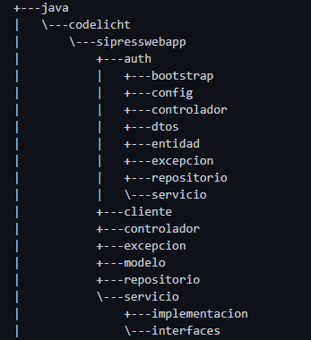

*Estructura de directorios del backend de SIPRESS*

Las clases allí definidas trabajan en conjunto para permitir la conexión y la transferencia de información entre los
paquetes y la información correspondiente en las tablas de la base de datos. Para el despliegue de la información, se
usa una tecnología **REST**, que facilita la comunicación entre el cliente y el servidor a través de peticiones **HTTP**
de tipo **GET** y **POST**, responsables del manejo y despliegue de la información en el navegador. A continuación, se
describen
los aspectos más importantes de los cinco paquetes principales. Los paquetes adicionales ```cliente``` y
```excepcion```,
tienen funciones accesorias y no es necesario describirlos en detalle. El primero contiene las clases que definen los
objetos que se envían al cliente, y el segundo, las excepciones personalizadas que se lanzan en caso de errores.

___

### Paquete ``modelo``

Este paquete contiene las clases de entidad. Estas clases representan las tablas de la base de datos y contienen las
anotaciones necesarias para la persistencia (mediante **JPA**), la serialización (para convertir objetos a formato *
*JSON**) y
las validaciones (para asegurar que los datos cumplan ciertos criterios antes de almacenarse).

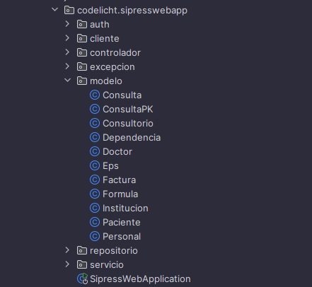

*Estructura del paquete modelo*

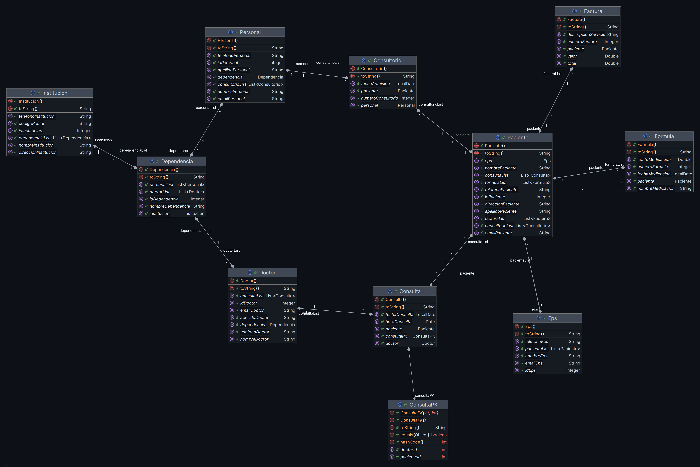

*Diagrama de clases del paquete modelo*

___

### Paquete ``repositorio``

Este paquete contiene las interfaces que extienden de JPA Repository. Estas interfaces permiten utilizar los métodos
**CRUD** (Crear, Leer, Actualizar y Eliminar) proporcionados por defecto por la **API** de **JPA**, lo que simplifica la
gestión de
peticiones a la base de datos.

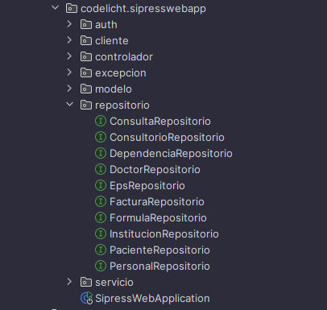

*Estructura del paquete repositorio*

___

### Paquete ``servicio``

Este paquete contiene las clases que implementan la lógica de negocio de la aplicación. Se divide en dos directorios
para la administración de interfaces y sus implementaciones:

* ```interfaces```: Define los métodos que se implementarán para realizar operaciones específicas en las entidades.
  Estas interfaces extienden el ```repositorio```.
* ```implementacion```: Contiene las clases que implementan los métodos definidos en las interfaces. Aquí se realiza la
  lógica de negocio y se gestionan las transacciones.

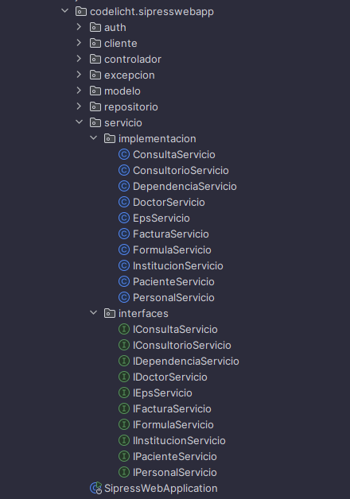

*Estructura del paquete servicio*

___

### Paquete ``controlador``

Este paquete contiene las clases que gestionan las peticiones **HTTP** (``GET``, ``POST``, ``PUT``, ``DELETE``)
realizadas por el
cliente. Los controladores integran los métodos específicos de los servicios para responder a las peticiones del cliente
y gestionar la información que se envía y recibe a través de los *endpoints* de tipo **REST**.

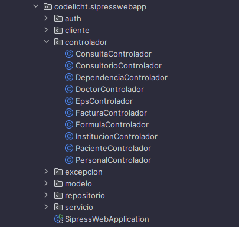

*Estructura del paquete controlador*

___

### Paquete ``auth``

Este paquete se encarga de implementar la lógica de seguridad en la aplicación, proporcionando la autenticación,
autorización, y manejo de usuarios. La lógica de seguridad se basa en el uso de tokens de tipo **JWT** (JSON Web Token),
que permiten la autenticación de los usuarios basada en roles y el acceso a los recursos de acuerdo con los permisos de
cada usuario. El directorio se divide en varios subdirectorios, cada uno con un rol específico en el funcionamiento de
la seguridad. A continuación, se describen los subdirectorios y las clases más importantes de cada
uno:

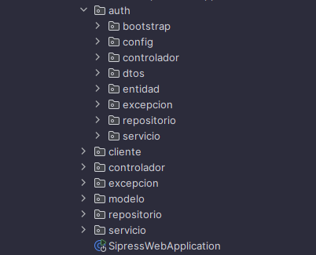

*Estructura del paquete auth*

#### Subdirectorios del paquete ``auth``

**1. ``bootstrap``:** Contiene la clase que se ejecuta al iniciar la aplicación. Aquí se configura la seguridad y se
establecen las reglas de acceso. Permite la creación de roles y la creación de un usuario con privilegios de
``SUPERADMIN`` al iniciar la aplicación.

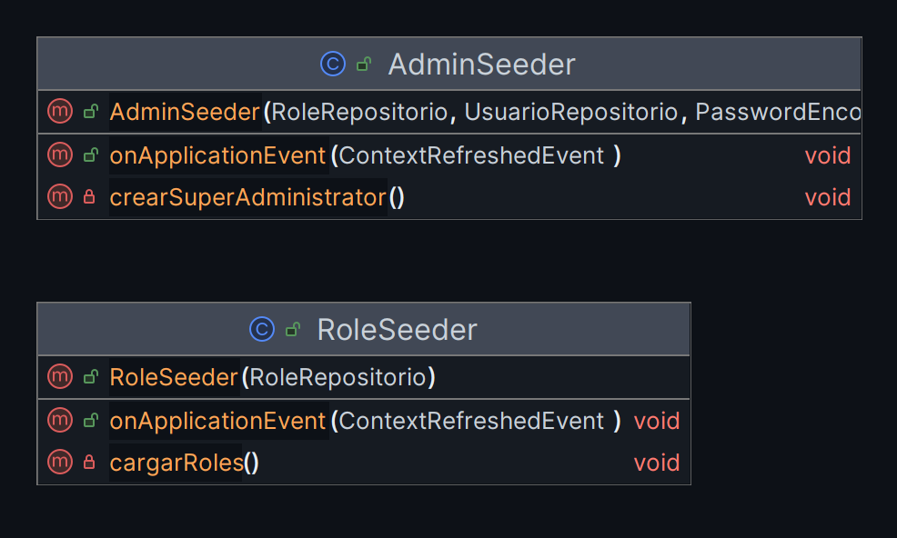

*Detalle de las clases del subdirectorio bootstrap*

___

**2. ``config``:** Contiene las clases de configuración de la seguridad. Aquí se establecen las reglas de acceso a los
*endpoints* de la aplicación, se configura el cifrado de las contraseñas y se establecen las reglas de acceso a los
usuarios.

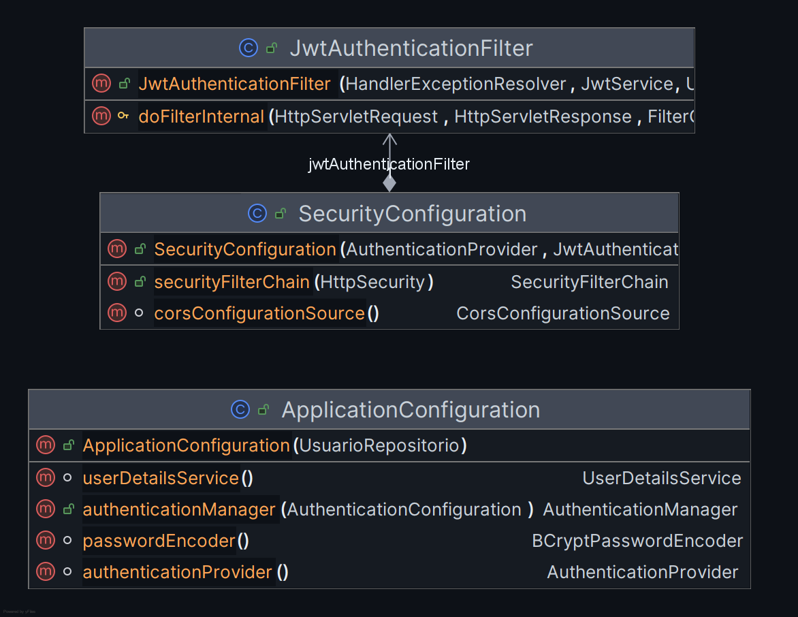

*Detalle de las clases del subdirectorio config*

___

**3. ``controlador``:** Contiene las clases que gestionan las peticiones **HTTP** relacionadas con la autenticación y
autorización de los usuarios. Aquí se definen los *endpoints* para el inicio de sesión y el registro de usuarios.

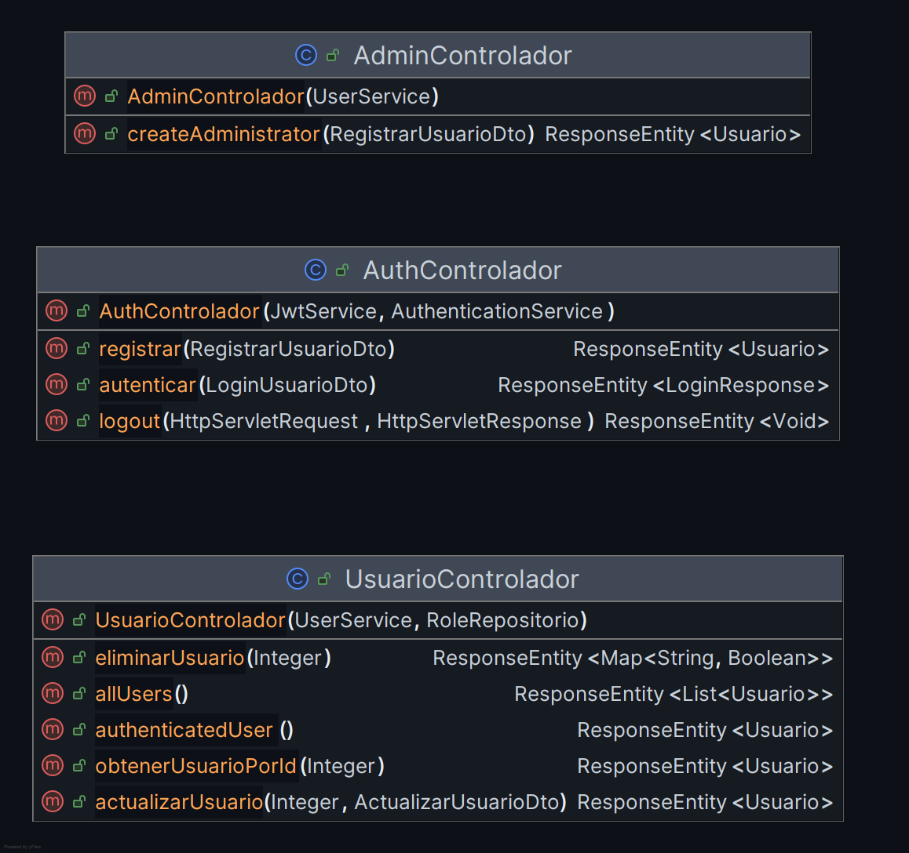

*Detalle de las clases del subdirectorio controlador*

___

**4. ``dtos``:** Contiene las clases que definen los objetos de transferencia de datos (DTO) relacionados con la
autenticación
y autorización de los usuarios. Estos objetos se utilizan para enviar y recibir información entre el cliente y el
servidor.

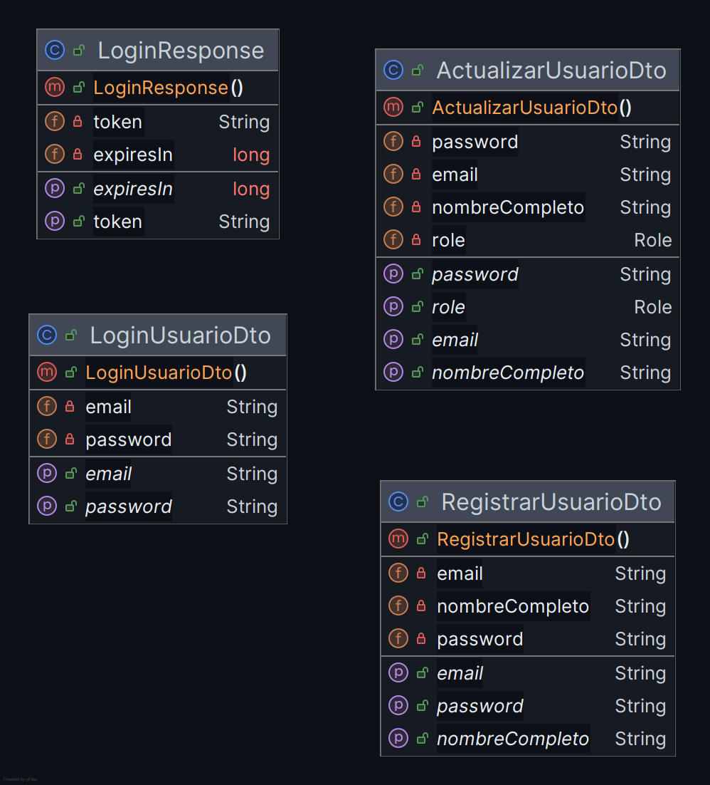

*Detalle de las clases del subdirectorio dtos*

___

**5. ``entidad``:** Contiene las clases de entidad relacionadas con la autenticación y autorización de los usuarios.
Estas
clases representan las tablas de la base de datos y contienen las anotaciones necesarias para la persistencia, la
serialización y las validaciones.

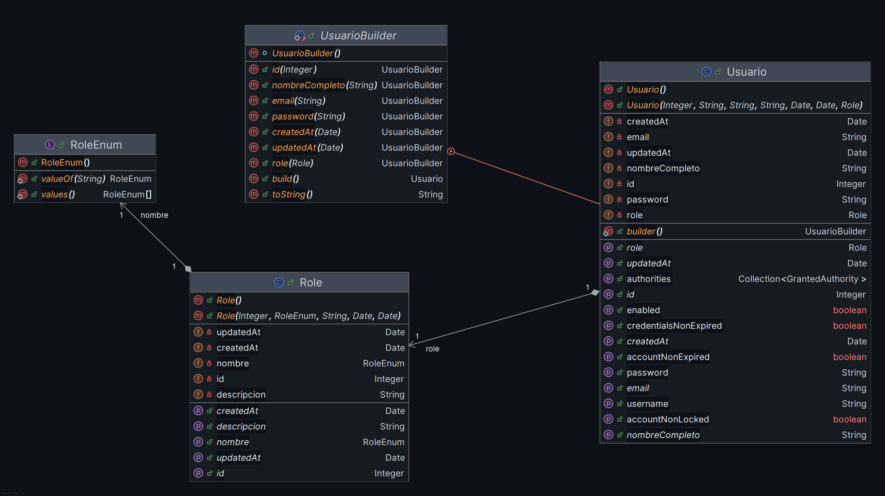

*Detalle de las clases del subdirectorio entidad*

___

**6. ``excepcion``:** Contiene las clases de excepción relacionadas con la autenticación y autorización de los usuarios.
Estas
clases se lanzan en caso de errores relacionados con la autenticación y autorización de los usuarios.

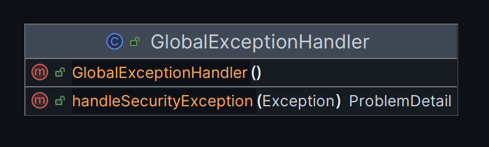

*Detalle de las clases del subdirectorio excepcion*

___

**7. ``repositorio``:** Contiene las interfaces que extienden de CRUD Repository. Estas interfaces permiten utilizar los
métodos CRUD proporcionados por defecto por la API de Spring Data JPA, lo que simplifica la gestión de peticiones a
la base de datos.


*Detalle de las clases del subdirectorio repositorio*

___

**8. ``servicio``:** Contiene las clases que implementan la lógica de negocio relacionada con la autenticación y
autorización
de los usuarios. Aquí se realizan las operaciones de autenticación, autorización, registro de usuarios y gestión de
tokens.

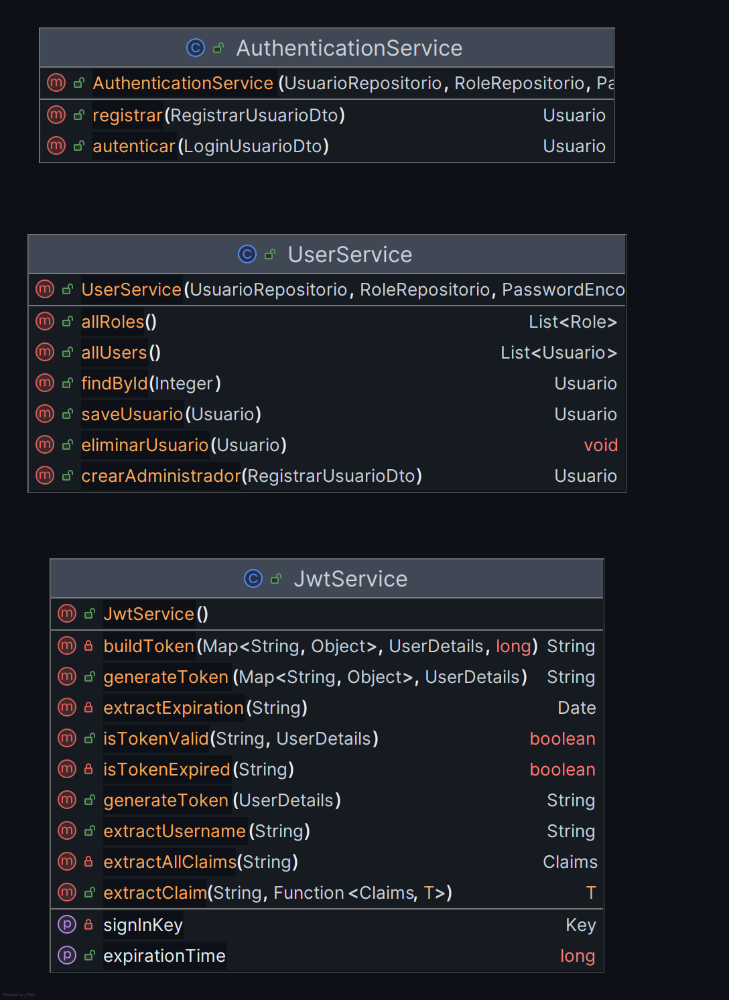

*Detalle de las clases del subdirectorio servicio*

___

### Documentación de la API

Para conocer más detalles sobre la implementación de la seguridad en la aplicación, se recomienda revisar la
documentación de la API y las pruebas realizadas con Postman en el directorio ``documentation``
[SIPRESS API](/documentation/API_DOCUMENTATION.md) o en el siguiente
enlace: [SIPRESS API Documentation](https://documenter.getpostman.com/view/37130978/2sAXjDfbBx)

___

## Diagrama de despliegue del sistema

Para ilustrar la estructura y las relaciones entre los componentes de la aplicación SIPRESS, se presenta a continuación
un diagrama de despliegue que muestra la arquitectura, las conexiones entre el backend, el frontend y otros componentes.

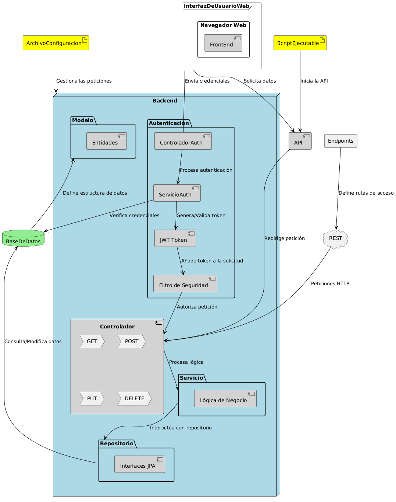

*Diagrama de despliegue de la arquitectura*

### Descripción general del diagrama de despliegue

Las relaciones entre componentes se basan en un modelo cliente-servidor, donde el cliente (navegador web) realiza
peticiones al servidor (backend) a través de la red. El servidor procesa las peticiones y envía las respuestas al
cliente, que se encarga de mostrar la información en la interfaz de usuario. Estas relaciones se pueden describir de la
siguiente manera:

#### **1. Interfaz de usuario Web (Navegador web) → API:**

Los usuarios interactúan con la aplicación a través del navegador web (``FrontEnd``). Cuando necesitan acceder a datos o
realizar acciones, el frontend envía solicitudes a la ``API``, que es el punto de entrada principal para todas las
peticiones del sistema.

#### **2. API → Controlador:**

La ``API`` redirige las solicitudes recibidas al ``Controlador`` adecuado en el backend, dependiendo de la naturaleza de
la solicitud (``GET``,``POST``,``PUT``,``DELETE``).

#### **3. Controlador → Servicio:**

El ``Controlador``procesa las solicitudes y delega la lógica de negocio al componente de ``Servicio``. Aquí es donde se
realiza la mayor parte del procesamiento y validación de las solicitudes.

#### **4. Servicio → Repositorio:**

El ``Servicio`` interactúa con el ``Repositorio`` para realizar operaciones de acceso a datos. Este componente maneja la
comunicación con la base de datos a través de interfaces JPA, facilitando las operaciones de lectura y escritura de
datos.

#### **5. Repositorio → Base de Datos:**

El ``Repositorio`` realiza consultas y modificaciones en la ``BaseDeDatos``, gestionando la persistencia de las
entidades que forman parte del modelo de datos.

#### **6. Base de Datos → Modelo:**

La ``BaseDeDatos`` almacena y mantiene la estructura de los datos a través de las entidades definidas en el ``Modelo``.
Estas entidades representan las tablas y relaciones en la base de datos.

#### **7. Archivo de Configuración → Backend:**

El ``ArchivoConfiguracion`` gestiona las configuraciones esenciales que afectan cómo se manejan las peticiones en el
``Backend``. Este archivo puede incluir configuraciones de seguridad, rutas, y otras propiedades necesarias para el
funcionamiento del sistema.

#### **8. Script Ejecutable → API:**

El ``ScriptEjecutable`` es responsable de iniciar la ``API`` y ponerla en funcionamiento. Este script lanza el servidor
y asegura que todos los servicios estén listos para manejar peticiones.

#### **9. REST → Controlador:**

La capa ``REST`` define cómo se manejan las peticiones ``HTTP`` en el Controlador. Aquí es donde se gestionan las rutas
y los métodos ``HTTP`` que corresponden a cada controlador.

#### **10. Endpoints → REST:**

Los ``Endpoints`` definen las rutas de acceso específicas que pueden ser utilizadas por los usuarios y sistemas para
interactuar con la ``API`` a través de ``HTTP``. Estas rutas se configuran en la capa ``REST``.

#### **11. Interfaz de Usuario Web → ControladorAuth (Autenticación):**

Cuando un usuario necesita autenticarse, las credenciales se envían desde el ``FrontEnd`` al ControladorAuth en el
``backend``.

#### **12. ControladorAuth → ServicioAuth (Autenticación):**

El ``ControladorAuth`` delega la verificación de credenciales y la generación de tokens ``JWT`` al ``ServicioAuth``, que
maneja la lógica de autenticación.

#### **13. ServicioAuth → JWT Token / Base de Datos:**

El ``ServicioAuth`` consulta la ``BaseDeDatos`` para verificar las credenciales del usuario. Si la autenticación es
exitosa, se genera un ``JWT Token`` que será utilizado en futuras solicitudes para identificar al usuario autenticado.

#### **14. JWT Token → Filtro de Seguridad (SecurityFilter):**

El ``JWT Token`` se adjunta a las solicitudes futuras mediante el ``SecurityFilter``, que verifica su validez y decide
si la solicitud debe ser autorizada para continuar hacia el ``Controlador``.

#### **15. Filtro de Seguridad → Controlador:**

Una vez que el ``SecurityFilter`` valida el ``JWT Token``, permite que la solicitud continúe hacia el ``Controlador``,
donde se procesará de acuerdo con la lógica de negocio.

---

## Información adicional

Para obtener más información sobre la arquitectura del backend de SIPRESS, se recomienda revisar el código fuente y la
documentación de las clases y métodos. Además, se puede consultar la documentación de la API y las pruebas realizadas
con Postman para comprender mejor el funcionamiento de la aplicación.

Enlace al repositorio de
GitHub: [SIPRESS Backend Repository](https://github.com/MauricioMonroy/SipressSpringApp/tree/main/backend)

---

# Referencias

- [Spring Boot](https://spring.io/projects/spring-boot)
- [Spring Data JPA](https://spring.io/projects/spring-data-jpa)
- [Spring Security](https://spring.io/projects/spring-security)
- [Spring Web](https://spring.io/guides/gs/spring-boot/)
- [Spring Boot Actuator](https://spring.io/guides/gs/actuator-service/)
- [Spring Boot DevTools](https://spring.io/guides/gs/spring-boot/)
- [Spring Boot HATEOAS](https://spring.io/guides/gs/rest-hateoas/)

---

## Contacto

Si tiene alguna pregunta o sugerencia sobre la arquitectura del backend de SIPRESS, no dude en ponerse en contacto conmigo:

- Correo electrónico: `mauricio.monroy0@soy.sena.edu.co` o `mauriciomonroy@live.cl`
