[](../frontend/src/assets/images/sapresis-logo.png)


# Manual de uso Sapresis

---

## Contenido

1. [Introducción](#1-introducción)
2. [Requisitos Previos](#2-requisitos-previos)
3. [Estructura de la Aplicación](#3-estructura-de-la-aplicación)
    - [3.1. Secciones Principales](#31-secciones-principales)
    - [3.2. Mapa general de navegación](#32-mapa-general-de-navegación)
    - [3.3. Descripción del flujo de navegación](#33-descripción-del-flujo-de-navegación)
        - [3.3.1. Inicio de sesión y acceso a la aplicación](#331-inicio-de-sesión-y-acceso-a-la-aplicación)
        - [3.3.2. Registro de usuario](#332-registro-de-usuario)
        - [3.3.3. Página principal y menú de navegación](#333-página-principal-y-menú-de-navegación)
        - [3.3.4. Listados y detalles](#334-listados-y-detalles)
        - [3.3.5. Formularios y edición](#335-formularios-y-edición)
        - [3.3.6. Mensajes y notificaciones](#336-mensajes-y-notificaciones)
        - [3.3.7. Responsividad y diseño adaptativo](#337-responsividad-y-diseño-adaptativo)
4. [Consideraciones técnicas](#4-consideraciones-técnicas)
5. [Conclusiones](#5-conclusiones)

---

## **1. Introducción**

Sapresis es un sistema integral para la prestación de servicios de salud. La aplicación permite al personal de salud
gestionar pacientes, consultas y otros aspectos clave de la atención sanitaria.

El objetivo de este manual es proporcionar una guía detallada sobre cómo utilizar Sapresis. A continuación, se describen
las funcionalidades principales y los pasos para acceder a ellas.

---

## **2. Requisitos Previos**

Antes de utilizar Sapresis, asegúrate de cumplir con los siguientes requisitos:

- **Navegador web recomendado**: Sapresis funciona correctamente en las versiones más recientes de Google Chrome, Mozilla
  Firefox y Microsoft Edge. Otros navegadores pueden ser compatibles, pero no están garantizados.
- **Resoluciones de pantalla**: La aplicación tiene un diseño responsivo y se adapta a diferentes tamaños de pantalla.
  Se recomienda una resolución mínima de 1024x768 píxeles para una experiencia óptima.
- **Acceso a la aplicación**: Actualmente, Sapresis se encuentra en fase de desarrollo y preproducción, por lo que no
  está disponible en un servidor público. Para acceder a la aplicación, es necesario ejecutarla localmente siguiendo los
  pasos detallados en el documento de instalación.

Una vez que ejecutes la aplicación localmente, podrás iniciar sesión con las credenciales proporcionadas o configurar
nuevas credenciales.

---

## **3. Estructura de la Aplicación**

Sapresis consta de varios módulos y funcionalidades que permiten gestionar diferentes aspectos de la atención sanitaria.
A continuación, se describen los principales módulos de la aplicación:

- **Gestión de Pacientes**: Permite agregar, editar y eliminar registros de pacientes. Proporciona información detallada
  sobre los pacientes, incluidos datos personales, historial médico y consultas asociadas.
- **Asignación de Consultas y Médicos**: Facilita la asignación de consultas a pacientes y médicos. Permite programar
  citas, verificar disponibilidad y gestionar el calendario de consultas.
- **Visualización de Fórmulas o Recetas Médicas**: Permite ver y descargar recetas médicas generadas para los pacientes.
  Proporciona información detallada sobre los medicamentos recetados, las dosis y las instrucciones de uso.
- **Gestión de Empleados y Consultorios**: Permite gestionar el personal de la institución, los doctores y los
  consultorios disponibles. Proporciona información detallada sobre los empleados, sus roles y las áreas de trabajo.
- **Gestion de Facturación**: Permite gestionar los detalles de facturación de los pacientes, incluidos los servicios
  prestados, los costos asociados y los métodos de pago. Facilita la generación de facturas y el seguimiento de los
  pagos realizados.
- **Administración de dependencias y sedes**: Permite gestionar las dependencias y sedes de la institución, incluidas
  las ubicaciones, los horarios de atención y los servicios disponibles. Facilita la coordinación entre las diferentes
  áreas de la institución y la asignación de recursos.

El acceso a estos módulos se realiza a través del menú de navegación principal, que proporciona enlaces a las diferentes
secciones de la aplicación. Cada sección contiene funcionalidades específicas y opciones de gestión de la información.
En la página de inicio también se proporcionan enlaces rápidos a las secciones principales. A continuación, se detallan
las secciones principales y las funcionalidades asociadas a cada una.

---

### **3.1. Secciones Principales**

La estructura de la aplicación y sus secciones se organiza en torno a las siguientes funcionalidades:

- **`Login`**: Página de inicio de sesión para acceder a la aplicación. Permite a los usuarios autenticarse con sus
  credenciales y acceder a las funcionalidades de Sapresis.
- **`Inicio (Home Page)`**: Página principal de la aplicación. Proporciona un resumen de las funcionalidades principales
  y enlaces rápidos a las secciones más utilizadas.
- **`Menú de Navegación (Navbar)`**: Proporciona acceso rápido a las diferentes secciones de la aplicación. Permite
  navegar entre las funcionalidades principales y gestionar la información de forma eficiente.
- **`Listados y Detalles`**: Muestra listados de pacientes, consultas, médicos y otros registros. Permite ver detalles,
  editar información y realizar acciones específicas sobre los registros.
- **`Formularios y Edición`**: Permite agregar nuevos registros, editar información existente y completar formularios
  con datos relevantes. Facilita la gestión de la información y la actualización de los registros.
- **`Consultas`**: Proporciona un calendario interactivo con las citas programadas. Permite ver la disponibilidad de
  médicos, asignar consultas y gestionar el horario de atención.
- **`Botones y Acciones`**: Facilita la interacción con la aplicación mediante botones y acciones específicas. Permite
  realizar operaciones como guardar cambios, eliminar registros y generar informes.
- **`Notificaciones y Alertas`**: Proporciona un feedback visual sobre las acciones realizadas. Muestra notificaciones
  de éxito, alertas de error y mensajes informativos para guiar al usuario.

---

### **3.2. Mapa general de navegación**

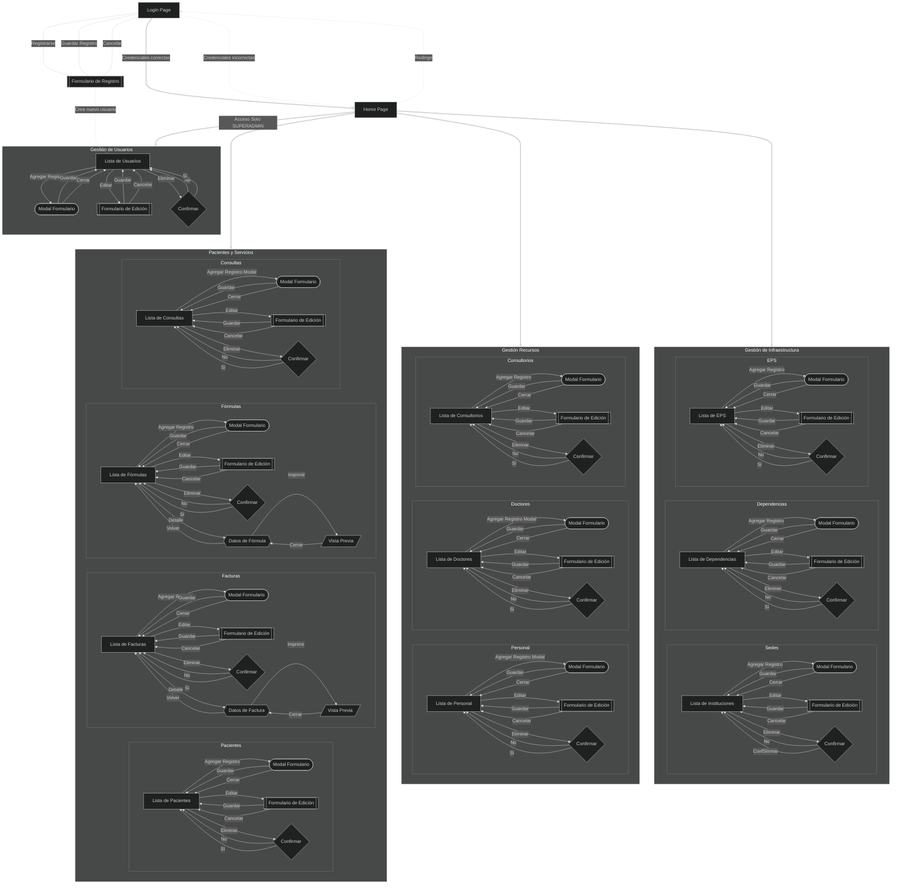

*Mapa general de navegación de Sapresis*

---

### **3.3. Descripción del flujo de navegación**

El flujo de navegación en Sapresis sigue un patrón común en las aplicaciones web. El flujo comienza con la página de
inicio de sesión (login). Al acceder a la aplicación, el usuario es recibido por esta página, la cual ofrece dos
opciones: iniciar sesión o registrarse como un nuevo usuario. Si un usuario no está registrado, puede hacerlo
proporcionando la información requerida: correo electrónico, nombre completo y contraseña. Una vez registrado, el
usuario puede iniciar sesión.

#### **3.3.1. Inicio de sesión y acceso a la aplicación**

* Para iniciar sesión, el usuario debe ingresar su correo electrónico y contraseña. Si las credenciales son válidas, el
  sistema redirige al usuario a la página principal de la aplicación. Si el usuario no tiene una cuenta, puede
  registrarse haciendo clic en el enlace correspondiente.

[](../frontend/src/assets/images/login-page.png)

*Visión general de la página de inicio de sesión*

* El sistema cuenta con tres roles de usuario: `USER`, `ADMIN` y `SUPERADMIN`. Cada rol tiene permisos específicos para
  acceder a diferentes secciones y funcionalidades de la aplicación.

* Todos los usuarios se registran con credenciales de usuario estándar. Para poder cambiar el rol de usuario, es
  necesario contar con un usuario `SUPERADMIN`.

* Los usuarios con rol `USER` tienen acceso a las funcionalidades básicas de la aplicación, como la visualización de
  listados y detalles de pacientes, consultas y médicos.

* La función de editar está disponible para `ADMIN` y `SUPERADMIN`, mientras que la función de eliminar está disponible
  solo para `SUPERADMIN`.

* Si las credenciales son incorrectas, el sistema muestra un mensaje de error y permite al usuario intentar nuevamente.

[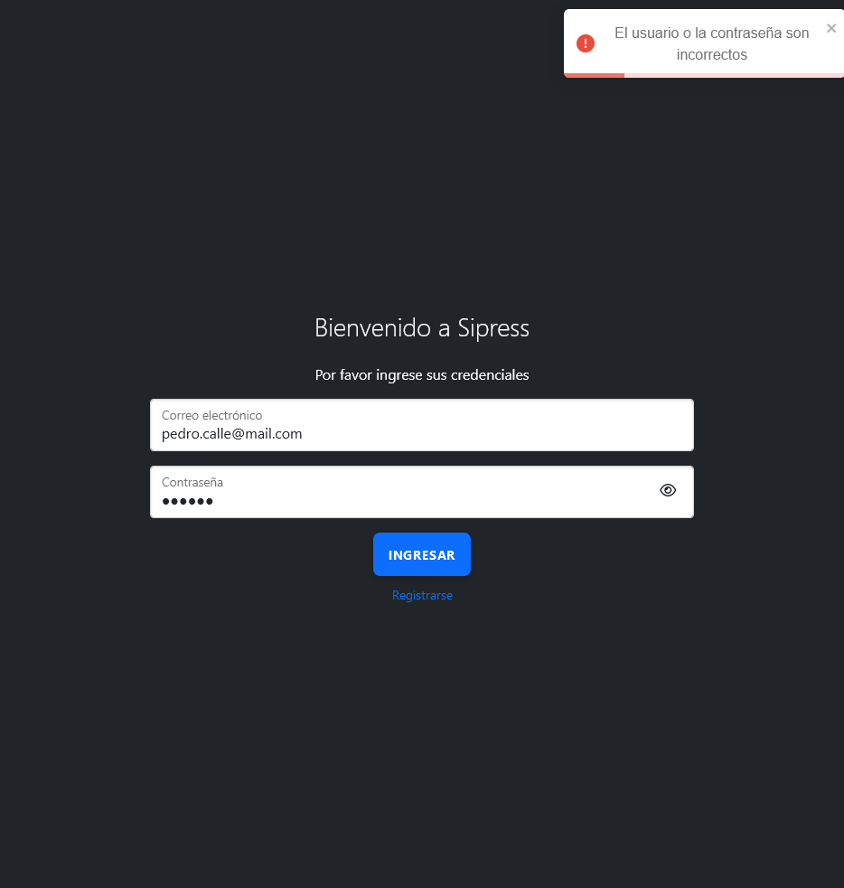](../frontend/src/assets/images/bad-credentials.png)

*Notificación de credenciales incorrectas*

#### **3.3.2. Registro de usuario**

* Para registrarse como nuevo usuario, el usuario debe proporcionar su correo electrónico, nombre completo y contraseña.
  Una vez completado el registro, el usuario puede iniciar sesión con las credenciales proporcionadas.

[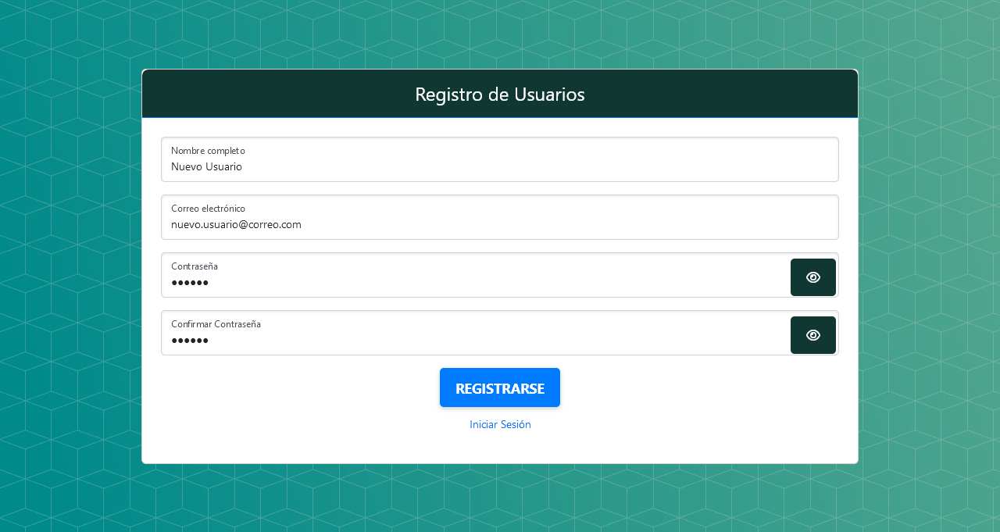](../frontend/src/assets/images/register-page.png)

#### **3.3.3. Página principal y menú de navegación**

* Una vez que el usuario ha iniciado sesión, se le redirige a la página principal de la aplicación. Aquí, el usuario
  puede ver un resumen de las funcionalidades principales y enlaces rápidos a las secciones más utilizadas.

[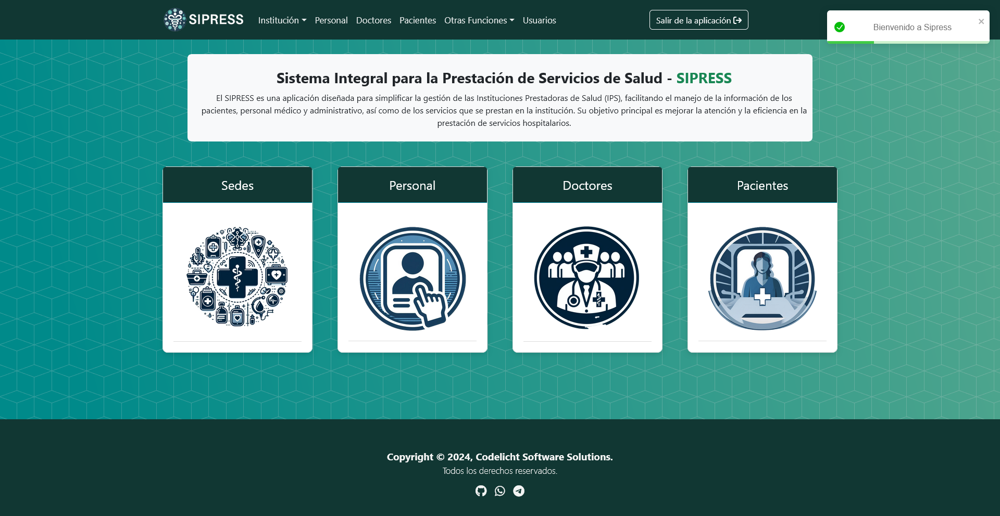](../frontend/src/assets/images/home-page.png)

*Visión general de la página principal*

* Todas las rutas de la aplicación están visibles para los roles `USER`, `ADMIN` y `SUPERADMIN`, excepto la sección *
  *Usuarios**, que está restringida exclusivamente a `SUPERADMIN`.

* El menú de navegación (navbar) proporciona acceso rápido a las diferentes secciones de la aplicación. Permite al
  usuario navegar entre las funcionalidades principales y gestionar la información de forma eficiente.

[](../frontend/src/assets/images/navbar.png)

*Visión general del menú de navegación*

#### **3.3.4. Listados y detalles**

* Las secciones de listados y detalles muestran registros de pacientes, consultas, médicos y otros datos relevantes.
  Cada listado está paginado y permite al usuario navegar entre las páginas de resultados, y permiten ver los datos de
  cada registro, así como editarlos o eliminarlos.

* En lo que sigue se mostrará un ejemplo de la sección de pacientes, pero el mismo principio se aplica a las demás
  secciones.

[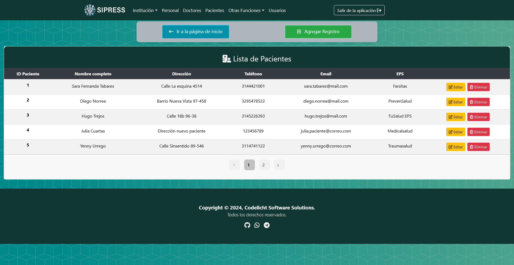](../frontend/src/assets/images/patients-list.png)

*Visión general del listado de pacientes*

#### **3.3.5. Formularios y edición**

* Los formularios y secciones de edición permiten agregar nuevos registros, editar información existente y completar
  formularios con datos relevantes. Facilitan la gestión de la información y la actualización de los registros.

* Para agregar un nuevo registro en cualquiera de las entidades se debe hacer clic en el botón `Agregar Registro` que se
  ubica en la parte superior derecha de las tablas. Al hacer clic en este botón se abrirá un modal con el formulario
  correspondiente.

[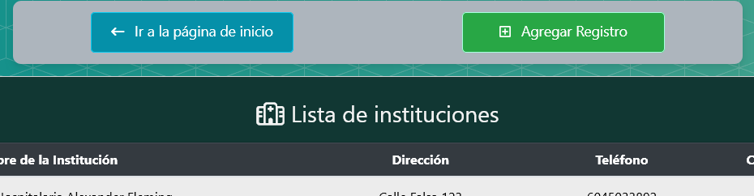](../frontend/src/assets/images/add-button.png)

*Visión general del botón de agregar registro*

[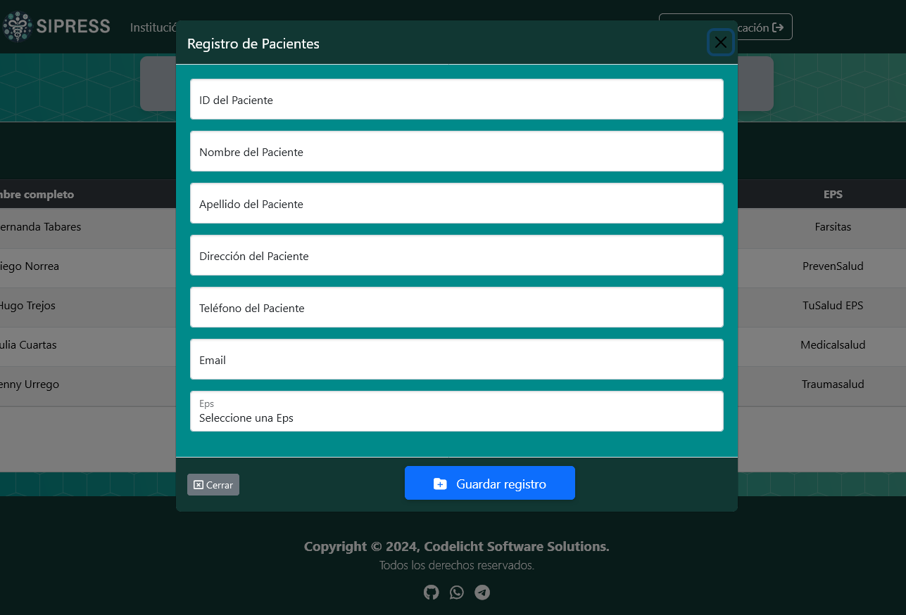](../frontend/src/assets/images/patient-modal.png)

*Visión general del modal de paciente*

* Para editar un registro existente, se debe hacer clic en el botón `Editar` que se encuentra en la fila del registro
  deseado. Al hacer clic en este botón se abrirá un modal con el formulario correspondiente, cargado con la información
  actual del registro.

[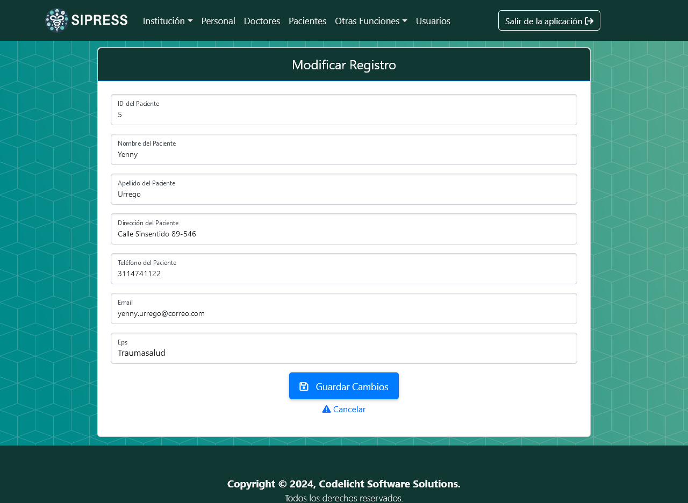](../frontend/src/assets/images/patient-form.png)

*Visión general del formulario de paciente*

#### **3.3.6. Mensajes y notificaciones**

* La aplicación proporciona notificaciones y alertas visuales para informar al usuario sobre el estado de las acciones
  realizadas. Estas notificaciones incluyen mensajes de éxito, alertas de error y mensajes informativos para guiar al
  usuario.

[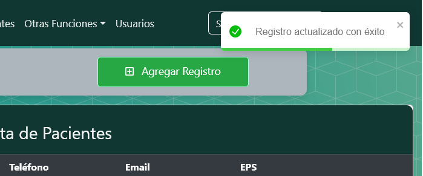](../frontend/src/assets/images/success-notification.png)

*Notificación de éxito*

[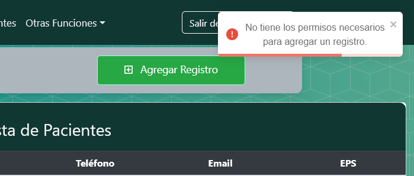](../frontend/src/assets/images/error-notification.png)

*Notificación de error*

[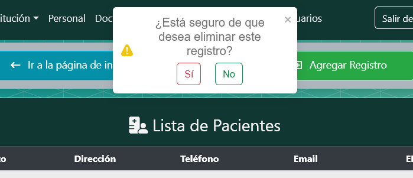](../frontend/src/assets/images/alert-message.png)

*Mensaje de alerta*

[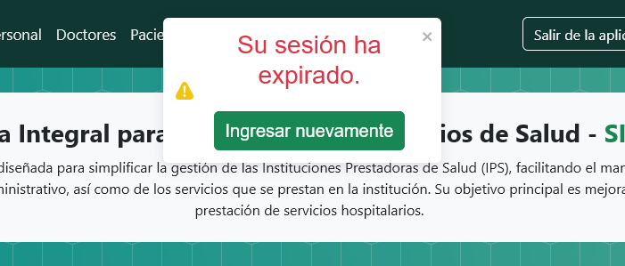](../frontend/src/assets/images/session-expired.png)

*Sesión expirada*

#### **3.3.7. Responsividad y diseño adaptativo**

* La aplicación Sapresis está diseñada para ser responsiva y adaptarse a diferentes tamaños de pantalla. Se recomienda
  una resolución mínima de 1024x768 píxeles para una experiencia óptima, pero la aplicación es compatible con
  resoluciones más bajas y dispositivos móviles.

[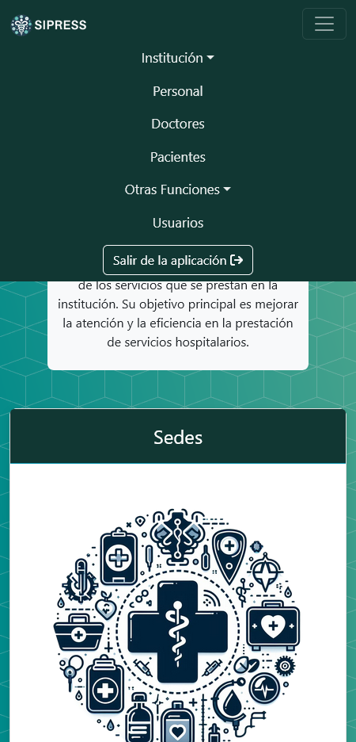](../frontend/src/assets/images/responsive-design.png)

*Visión general del diseño responsivo*

---

## **4. Consideraciones técnicas**

Sapresis está desarrollado con tecnologías modernas y estándares de la industria. Para el desarrollo del frontend se
utilizó React, HTML, CSS, Bootstrap 5, JavaScript y los iconos FontAwesome.

Como gran parte del código se realizó con React, es necesario especificar que la aplicación se divide en componentes
reutilizables que se utilizan en diferentes partes de la aplicación. Esto permite una mayor modularidad y mantenibilidad
del código.

Los componentes de React utilizados en Sapresis incluyen:

- **Axios**: Para realizar peticiones HTTP al backend y gestionar las respuestas.
- **React Router**: Para gestionar la navegación entre las diferentes secciones de la aplicación.
- **React Router Dom**: Para gestionar las rutas y enlaces de la aplicación.
- **React Bootstrap**: Para utilizar componentes de Bootstrap en React y mantener la coherencia visual.
- **React Toastify**: Para mostrar notificaciones y alertas visuales al usuario.
- **PrimeReact**: Para utilizar componentes de PrimeReact en React y mejorar la experiencia del usuario.
- **Day.js**: Para gestionar fechas y horas en la aplicación de forma eficiente.
- **DOTS**: Para gestionar la paginación de los listados de registros.

Estas tecnologías y librerías permiten una implementación eficiente y escalable de la aplicación, garantizando un
rendimiento óptimo y una experiencia de usuario satisfactoria.

---

## **5. Conclusiones**

Sapresis es una aplicación integral para la gestión de servicios de salud que ofrece una amplia gama de funcionalidades
para el personal de salud. La aplicación proporciona una interfaz intuitiva y fácil de usar, que permite a los usuarios
gestionar pacientes, consultas, médicos y otros aspectos clave de la atención sanitaria de forma eficiente.

El manual de uso de Sapresis proporciona una guía detallada sobre cómo utilizar la aplicación, describiendo las
funcionalidades principales y los pasos para acceder a ellas. La estructura de la aplicación, los módulos y las
secciones se presentan de forma clara y concisa, facilitando la comprensión y el uso de la aplicación.

En resumen, Sapresis es una herramienta poderosa y versátil que puede mejorar la eficiencia y la calidad de los servicios
de salud. Con una interfaz amigable y funcionalidades avanzadas, Sapresis se posiciona como una solución integral para la
gestión de servicios de salud en instituciones médicas y centros de atención sanitaria.

Para obtener más información sobre Sapresis, sus funcionalidades y su implementación, consulte la documentación técnica y
los recursos disponibles en el repositorio del proyecto.

---

**Nota**: Este manual de uso de Sapresis es parte del proyecto académico para la Tecnología de Análisis y Desarrollo de
Software (2721455) del SENA, y fue realizado por el aprendiz Mauricio Alberto Monroy Calle.

**Licencia**: [MIT](../LICENSE.md)

---

## Autor

### Mauricio Alberto Monroy Calle

- [GitHub](https://github.com/MauricioMonroy)

Si tiene alguna pregunta o sugerencia sobre la arquitectura del backend de Sapresis, no dude en ponerse en contacto
conmigo:

- Correo electrónico: `mauricio.monroy0@soy.sena.edu.co` o `mauriciomonroy@live.cl`

**Fecha**: Septiembre de 2024

---

## **Versión**

1.0.0

---

[Regresar al inicio](#manual-de-uso-sapresis)
[]: # (END)
```


